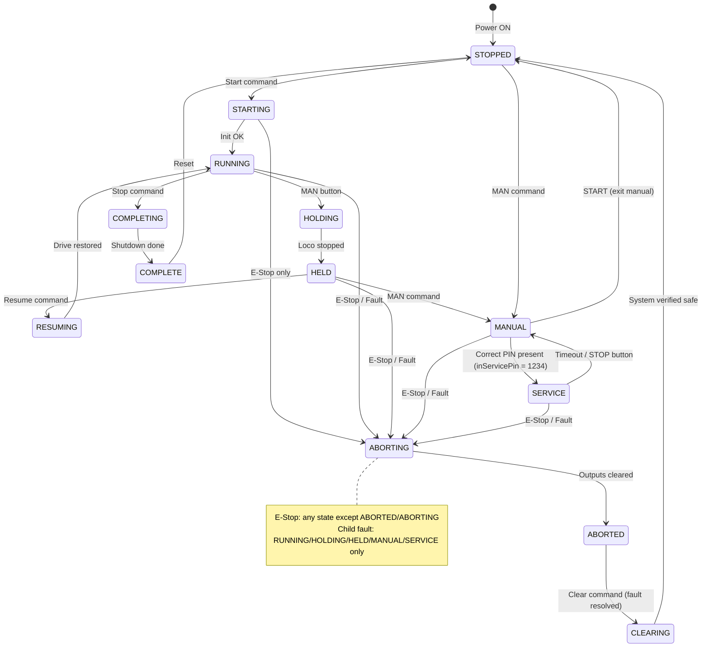
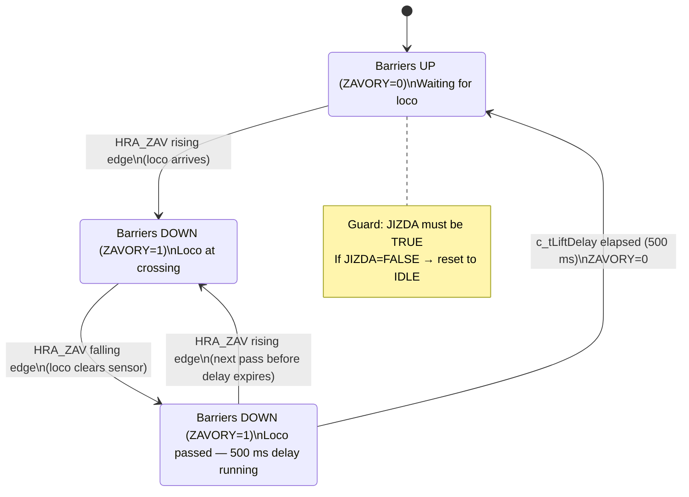
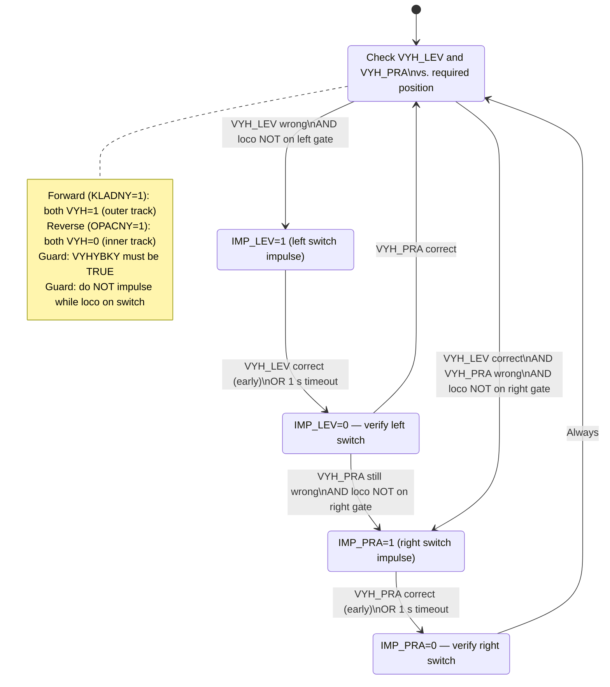

# REMIZ — Project Documentation
## Railway Model Automation — L4_kolejiste (Barrier & Switch Control)
### ŘPA Semester Project · TwinCAT 3 / Beckhoff

---

| Field | Value |
|---|---|
| **Project name** | REMIZ — Railway Model Control System |
| **Module** | L4_kolejiste — Barrier control (L4a) + Switch routing (L4b) |
| **PLC platform** | Beckhoff TwinCAT 3 — `[PLACEHOLDER: insert exact PLC model, e.g. CX5140]` |
| **PLC runtime port** | 854 |
| **Programming language** | IEC 61131-3 Structured Text (TwinCAT 3) |
| **SCADA** | mySCADA (via OPC UA / TF6100) |
| **Author** | `[PLACEHOLDER: name]` |
| **Date** | 2026-05-08 |
| **AI model used** | Claude Sonnet 4.6 (claude-sonnet-4-6) |

---

## Table of Contents

1. [System Overview](#1-system-overview)
2. [Requirements — Automation Pyramid](#2-requirements--automation-pyramid)
   - 2.1 [Level 0 — Technology](#21-level-0--technology)
   - 2.2 [Level 1 — Field Instrumentation](#22-level-1--field-instrumentation)
   - 2.3 [Level 2 — Control (PLC)](#23-level-2--control-plc)
   - 2.4 [Level 3 — Supervisory (SCADA)](#24-level-3--supervisory-scada)
3. [I/O Tables](#3-io-tables)
   - 3.1 [Field-Level Signal Table](#31-field-level-signal-table)
   - 3.2 [PLC I/O Table (Control Level)](#32-plc-io-table-control-level)
   - 3.3 [SCADA Variables](#33-scada-variables)
4. [Electrical Schematic](#4-electrical-schematic)
5. [Operating States](#5-operating-states)
   - 5.1 [State Table (PackML)](#51-state-table-packml)
   - 5.2 [State Diagram](#52-state-diagram)
6. [Technology Sequences](#6-technology-sequences)
   - 6.1 [L4a — Barrier Control](#61-l4a--barrier-control)
   - 6.2 [L4b — Switch Routing](#62-l4b--switch-routing)
7. [Program Architecture](#7-program-architecture)
   - 7.1 [FB Decomposition](#71-fb-decomposition)
   - 7.2 [File Structure](#72-file-structure)
   - 7.3 [Variable Naming Conventions](#73-variable-naming-conventions)
   - 7.4 [Commented Source Code Reference](#74-commented-source-code-reference)
8. [OPC UA / SCADA Integration](#8-opc-ua--scada-integration)
9. [Cross-Reference](#9-cross-reference)
10. [Test Protocol](#10-test-protocol)
11. [AI Conversation Logs](#11-ai-conversation-logs)

---

## 1. System Overview

The REMIZ project automates a model railway layout (N-scale). Module **L4_kolejiste** controls two subsystems:

- **L4a — Barrier control:** Automatically lowers and raises a level-crossing barrier when a locomotive is detected at the crossing sensor.
- **L4b — Switch routing:** Automatically aligns turnout switches to the correct position based on the selected locomotive drive direction, with anti-collision protection.

The system operates in three modes: **AUTOMATION**, **MANUAL**, and **SERVICE**. It follows the PackML state model and exposes status/control variables to mySCADA via OPC UA (TF6100).

The project does not include pneumatic actuators. All actuators are electromechanical (DC motor via relay, solenoid impulse coils, barrier relay). An electrical schematic is provided in Section 4.

> **Note on physical setup:** The system was implemented and tested on a Beckhoff TwinCAT 3 controller (`[PLACEHOLDER: model]`). Physical wiring and I/O connections were set up in the lab. No electro-pneumatic components are used in this module.

---

## 2. Requirements — Automation Pyramid

### 2.1 Level 0 — Technology

Physical components that perform work on the track layout:

| # | Component | Description |
|---|---|---|
| T-01 | Oval track (main loop) | Fixed N-scale single-track loop; energised when drive is active |
| T-02 | Double-track section | Short parallel segment (left side); inner/outer track selectable via switches |
| T-03 | Dead-end siding | De-energised branch; energised only when rear switch routes power there |
| T-04 | Locomotive (EMD GP38) | Single DC loco, 0–14 V, direction controlled by relay polarity |
| T-05 | Modelling transformer | Supplies 0–14 V DC to rails |
| T-06 | Level-crossing barriers | Electromechanical actuator; lowered/raised by relay output |
| T-07 | Left turnout solenoid | Bistable impulse solenoid; toggled by brief electrical pulse |
| T-08 | Right turnout solenoid | Bistable impulse solenoid; toggled by brief electrical pulse |
| T-09 | Rear turnout solenoid | Bistable impulse solenoid; toggled by brief electrical pulse |
| T-10 | Relay board | Interfaces EtherCAT DO terminals to track-level voltages |

### 2.2 Level 1 — Field Instrumentation

Requirements for sensors and actuators at the field level:

| # | Requirement | Sensor/Actuator |
|---|---|---|
| F-01 | Detect loco presence at left gate | Opt-sens-1 (HRA_LEV) |
| F-02 | Detect loco presence at right gate | Opt-sens-2 (HRA_PRA) |
| F-03 | Detect loco presence at rear gate | Opt-sens-3 (HRA_ZAD) |
| F-04 | Detect loco presence at barrier crossing | Opt-sens-4 (HRA_ZAV) |
| F-05 | Read left switch position feedback | Pos-sens-C (VYH_LEV): 0=inner, 1=outer |
| F-06 | Read right switch position feedback | Pos-sens-D (VYH_PRA): 0=inner, 1=outer |
| F-07 | Read rear switch position feedback | Pos-sens-E (VYH_ZAD): 0=main, 1=siding |
| F-08 | Read operator direction selection | Dir-sens-A (PRE_KLA / PRE_OPA) |
| F-09 | Manual override buttons (3×) | Push-btn-C/D/E (TLA_LEV/PRA/ZAD) |
| F-10 | Drive loco forward | Actuator A — output YA1 (KLADNY) |
| F-11 | Drive loco reverse | Actuator A — output YA0 (OPACNY) |
| F-12 | Lower / raise barriers | Actuator B — output YB (ZAVORY): 1=down |
| F-13 | Toggle left switch | Actuator C — impulse output YC (IMP_LEV) |
| F-14 | Toggle right switch | Actuator D — impulse output YD (IMP_PRA) |
| F-15 | Toggle rear switch | Actuator E — impulse output YE (IMP_ZAD) |

### 2.3 Level 2 — Control (PLC)

| # | Requirement | Notes |
|---|---|---|
| C-01 | Execute L4a barrier control logic | `FB_Barrier`; state machine: IDLE → BLOCKED → LIFTING |
| C-02 | Execute L4b switch routing logic | `FB_SwitchRouter`; state machine: IDLE → IMPULSE_x → CHECK_x |
| C-03 | Enforce drive mutual exclusion | KLADNY and OPACNY never simultaneously TRUE |
| C-04 | Sequence switch impulses (one at a time) | Max 1 s timeout (`c_tImpulseMax`); position sensor confirms completion |
| C-05 | Detect voltage fault (PRE_KLA AND PRE_OPA) | Enter fault state; stop drive; set gvFault |
| C-06 | Assert VYHYBKY on startup | PLC takes switch control before any routing |
| C-07 | Assert JIZDA on startup | PLC takes drive control in automated mode |
| C-08 | Expose status variables to supervisory level | Via `GVL_SCADA` with OPC UA pragmas |
| C-09 | Provide TwinCAT PLC Visualization (HMI) | `VIS_Main.TcVIS`: sensor lamps, fault banner, manual override buttons |
| C-10 | Run on Beckhoff TwinCAT 3 / EtherCAT | 10 ms scan cycle; IEC 61131-3 Structured Text |
| C-11 | AUTOMATION mode | Full automatic L4a + L4b cycle |
| C-12 | MANUAL mode | Individual actuator control via HW buttons or SCADA M-variables; anti-collision active |
| C-13 | SERVICE mode | Manual control without anti-collision; access secured by 4-digit PIN |
| C-14 | Standard button interface | START, RESET, STOP, MAN, E-STOP (NC 3-wire) |
| C-15 | FDI diagnostics per drive circuit | Timeout detection, sensor disagreement, voltage fault |
| C-16 | E-STOP 3-wire NC wiring | Break in any conductor treated as E-STOP activation |

### 2.4 Level 3 — Supervisory (SCADA)

The supervisory level is implemented via **mySCADA** connected over OPC UA (TF6100).

| # | Requirement | Notes |
|---|---|---|
| S-01 | Expose system state (`systemstav`) | PackML state as numeric value via `%MW106` |
| S-02 | Expose technology state (`techstav`) | Combined L4a/L4b state via `%MW104` |
| S-03 | SCADA equivalents of all operator buttons | M-variables `%M100.0`–`%M100.4` |
| S-04 | SCADA manual actuator controls | M-variables `%M101.0`–`%M101.5` |
| S-05 | OPC UA server on port 4840 | TF6100 standalone Configurator |
| S-06 | mySCADA remote server mapping | All SCADA variables mapped as tags in mySCADA project |

---

## 3. I/O Tables

### 3.1 Field-Level Signal Table

#### Inputs (Sensors)

| Generic Name | Type | Physical Description | Active State | PLC Symbol |
|---|---|---|---|---|
| Opt-sens-1 | Digital Input | Optical gate — left (double-track entry) | 1 = loco present | HRA_LEV |
| Opt-sens-2 | Digital Input | Optical gate — right (double-track exit) | 1 = loco present | HRA_PRA |
| Opt-sens-3 | Digital Input | Optical gate — rear (siding area) | 1 = loco present | HRA_ZAD |
| Opt-sens-4 | Digital Input | Optical gate — barrier crossing | 1 = loco present | HRA_ZAV |
| Pos-sens-C | Digital Input | Left switch position feedback | 1 = outer track | VYH_LEV |
| Pos-sens-D | Digital Input | Right switch position feedback | 1 = outer track | VYH_PRA |
| Pos-sens-E | Digital Input | Rear switch position feedback | 1 = siding | VYH_ZAD |
| Dir-sens-A-fwd | Digital Input | Operator direction switch — forward | 1 = forward selected | PRE_KLA |
| Dir-sens-A-rev | Digital Input | Operator direction switch — reverse | 1 = reverse selected | PRE_OPA |
| Push-btn-C | Digital Input | Manual push button — left switch | 1 = pressed | TLA_LEV |
| Push-btn-D | Digital Input | Manual push button — right switch | 1 = pressed | TLA_PRA |
| Push-btn-E | Digital Input | Manual push button — rear switch | 1 = pressed | TLA_ZAD |

#### Outputs (Actuators)

| Generic Name | Actuator | Type | Physical Description | Active State | PLC Symbol |
|---|---|---|---|---|---|
| YA1 | A (Loco drive) | Digital Output | Drive relay — forward polarity | 1 = forward drive | KLADNY |
| YA0 | A (Loco drive) | Digital Output | Drive relay — reverse polarity | 1 = reverse drive | OPACNY |
| YB | B (Barriers) | Digital Output | Barrier relay | 1 = barriers DOWN | ZAVORY |
| YC | C (Left switch) | Digital Output | Left switch impulse solenoid | 1 = toggle pulse | IMP_LEV |
| YD | D (Right switch) | Digital Output | Right switch impulse solenoid | 1 = toggle pulse | IMP_PRA |
| YE | E (Rear switch) | Digital Output | Rear switch impulse solenoid | 1 = toggle pulse | IMP_ZAD |

> **Note:** YA1 and YA0 are mutually exclusive. YC, YD, YE are impulse outputs — held HIGH until position sensor confirms or `c_tImpulseMax` (1 s) elapses. Only one impulse may be active at a time.

#### Internal PLC Control Outputs (takeover flags)

| Generic Name | Type | Description | Active State | PLC Symbol |
|---|---|---|---|---|
| PLC-ctrl-drive | Digital Output | PLC asserts drive control | 1 = PLC owns drive | JIZDA |
| PLC-ctrl-switch | Digital Output | PLC asserts switch control | 1 = PLC owns switches | VYHYBKY |

---

### 3.2 PLC I/O Table (Control Level)

Signals as declared in `IO.TcGVL`, with EtherCAT addresses.

#### Digital Inputs

| PLC Symbol | EtherCAT Address | Field Signal | Description |
|---|---|---|---|
| HRA_LEV | %IX1.1 | Opt-sens-1 | Left gate — loco present |
| HRA_PRA | %IX1.0 | Opt-sens-2 | Right gate — loco present |
| HRA_ZAD | %IX1.2 | Opt-sens-3 | Rear gate — loco present |
| HRA_ZAV | %IX1.3 | Opt-sens-4 | Barrier gate — loco present |
| VYH_LEV | %IX0.0 | Pos-sens-C | Left switch position (1=outer) |
| VYH_PRA | %IX0.1 | Pos-sens-D | Right switch position (1=outer) |
| VYH_ZAD | %IX0.2 | Pos-sens-E | Rear switch position (1=siding) |
| PRE_KLA | %IX0.3 | Dir-sens-A-fwd | Operator: forward selected |
| PRE_OPA | %IX0.4 | Dir-sens-A-rev | Operator: reverse selected |
| TLA_LEV | %IX0.5 | Push-btn-C | Manual button — left switch |
| TLA_PRA | %IX0.6 | Push-btn-D | Manual button — right switch |
| TLA_ZAD | %IX0.7 | Push-btn-E | Manual button — rear switch |

#### Digital Outputs

| PLC Symbol | EtherCAT Address | Field Signal | Description |
|---|---|---|---|
| KLADNY | %QX0.5 | YA1 | Drive forward |
| OPACNY | %QX0.6 | YA0 | Drive reverse |
| ZAVORY | %QX0.4 | YB | Barriers (1=DOWN) |
| IMP_LEV | %QX0.7 | YC | Left switch impulse |
| IMP_PRA | %QX1.0 | YD | Right switch impulse |
| IMP_ZAD | %QX1.1 | YE | Rear switch impulse |
| VYHYBKY | %QX1.2 | PLC-ctrl-switch | PLC owns switch control |
| JIZDA | %QX1.3 | PLC-ctrl-drive | PLC owns drive control |

---

### 3.3 SCADA Variables

Variables exported to mySCADA via OPC UA (`SCADA.TcGVL`, attribute `OPC.UA.DA`).

#### Command Variables (SCADA → PLC)

| Variable | Address | Type | Description |
|---|---|---|---|
| `SCADA_START` | `%MX100.0` | BOOL | Start command |
| `SCADA_RESET` | `%MX100.1` | BOOL | Reset / clear fault |
| `SCADA_STOP` | `%MX100.2` | BOOL | Stop command |
| `SCADA_MAN` | `%MX100.3` | BOOL | Manual mode select |
| `SCADA_ESTOP` | `%MX100.4` | BOOL | Software E-STOP |
| `SCADA_MAN_KLADNY` | `%MX101.0` | BOOL | Manual: drive forward |
| `SCADA_MAN_OPACNY` | `%MX101.1` | BOOL | Manual: drive reverse |
| `SCADA_MAN_ZAVORY` | `%MX101.2` | BOOL | Manual: barriers down |
| `SCADA_MAN_IMP_LEV` | `%MX101.3` | BOOL | Manual: toggle left switch |
| `SCADA_MAN_IMP_PRA` | `%MX101.4` | BOOL | Manual: toggle right switch |
| `SCADA_MAN_IMP_ZAD` | `%MX101.5` | BOOL | Manual: toggle rear switch |
| *(reserved)* | `%MX101.6`–`%MX103.7` | BOOL | Reserved for other modules |

#### Status Variables (PLC → SCADA)

| Variable | Address | Type | Description |
|---|---|---|---|
| `techstav` | `%MW104` | WORD | Technology state — high byte = L4a, low byte = L4b |
| `systemstav` | `%MW106` | WORD | PackML system state (see Section 5.1) |

---

## 4. Electrical Schematic

> **`[PLACEHOLDER]`**
>
> Insert electrical schematic here. The schematic should show:
> - E-STOP 3-wire (NC) connection to the PLC input
> - Optical sensor (24V) connections to PLC digital inputs (%IX)
> - Position sensor connections
> - Manual push button connections
> - PLC digital output connections to relay board
> - Relay board outputs to loco drive motor, barrier actuator, switch solenoids
> - 24V DC power supply for PLC / sensors
> - 0–14V DC transformer for track supply
>
> Recommended tool: draw.io / diagrams.net (Electrical shape library)
>
> File to attach: `schematic.pdf` or `schematic.png`

---

## 5. Operating States

### 5.1 State Table (PackML)

The system is modelled as a single machine following the ISA-88 PackML state model with extensions for MANUAL and SERVICE modes.

| Value | State | What happens | How to enter |
|---|---|---|---|
| 0 | **STOPPED** | All outputs de-energised. KLADNY=0, OPACNY=0, ZAVORY=0. JIZDA and VYHYBKY not asserted. System is safe and idle. | Power-on, or after STOPPING / CLEARING completes. |
| 1 | **STARTING** | Short initialization delay (200 ms) to allow I/O to stabilize. No outputs active yet. VYHYBKY and JIZDA are asserted when RUNNING begins (`outEnable_Auto` → TRUE). | START command issued from STOPPED. |
| 2 | **RUNNING** | Normal automatic operation: L4a barrier control and L4b switch routing both active. Locomotive drives in selected direction. | STARTING completes without fault. |
| 3 | **HOLDING** | Loco stopped (KLADNY=0, OPACNY=0). Barriers held in current state. Switch control maintained. Waiting for condition to clear. | HOLD command from RUNNING, or internal pause condition. |
| 4 | **HELD** | System paused. Drive stopped. All outputs stable. PLC running but no new commands issued. | HOLDING completes its stop sequence. |
| 5 | **RESUMING** | Restores drive direction from PRE_KLA/PRE_OPA. Re-engages L4a and L4b logic. | RESUME command from HELD. |
| 6 | **COMPLETING** | Graceful shutdown: stop loco, raise barriers, release VYHYBKY and JIZDA. | STOP command from RUNNING. |
| 7 | **COMPLETE** | All outputs off. System at rest. Ready to restart cleanly. | COMPLETING sequence finishes. |
| 8 | **ABORTING** | Immediate stop: all outputs de-energised instantly. gvFault flag set. | E-STOP activated OR fault detected (PRE_KLA AND PRE_OPA both TRUE), from **any** state. |
| 9 | **ABORTED** | System halted in fault state. gvFault=TRUE. No outputs active. Requires operator acknowledgement. | ABORTING sequence completes. |
| 10 | **CLEARING** | Operator acknowledges fault. gvFault cleared. Outputs verified de-energised. | RESET command from ABORTED after fault is resolved and E-STOP cleared. |
| 11 | **MANUAL** | Individual actuator commands passed through (HW buttons or SCADA M-variables). Anti-collision interlocks active. | MAN command from STOPPED. |
| 12 | **SERVICE** | Full manual control without anti-collision protection. PIN-secured access (`c_ServicePin = 1234`). Auto-exits after 5 min or STOP. | `inServicePin = 1234` (non-zero) while in MANUAL. Wire HMI PIN field to `inServicePin` in MAIN. |

#### E-STOP Behaviour by State

| Current State | E-STOP action |
|---|---|
| RUNNING / HOLDING / HELD / STARTING | Immediate de-energise all outputs → ABORTING |
| STOPPED / COMPLETE | All outputs already de-energised → ABORTING → ABORTED. Require RESET after E-STOP cleared. |
| MANUAL / SERVICE | Immediate de-energise all outputs → ABORTING |

#### FDI (Fault Detection and Isolation)

Each drive circuit includes diagnostics:

Fault codes are **per-FB** — the same numeric value has different meaning depending on which FB raises it. Read `fbBarrier.outFaultCode`, `fbSwitchRouter.outFaultCode`, and `fbDrive.outFaultCode` separately.

| FB | Fault Code | Condition | Action |
|---|---|---|---|
| `FB_Barrier` | 0x0101 | Barriers did not lower within `c_tFDI_Timeout` (placeholder — no position sensor yet) | Set fault, → ABORTING |
| `FB_Barrier` | 0x0102 | Barriers did not raise within `c_tFDI_Timeout` (placeholder — no position sensor yet) | Set fault, → ABORTING |
| `FB_SwitchRouter` | 0x0001 | Left switch (C) did not respond to impulse — position sensor still wrong after CHECK_C | Set fault, → ABORTING |
| `FB_SwitchRouter` | 0x0002 | Right switch (D) did not respond to impulse — position sensor still wrong after CHECK_D | Set fault, → ABORTING |
| `FB_SwitchRouter` | 0x0003 | Left and right switch position sensors disagree (VYH_LEV ≠ VYH_PRA) | Set fault, → ABORTING |
| `FB_DriveCtrl` | 0x0001 | Voltage fault — PRE_KLA AND PRE_OPA both TRUE (transformer protection tripped) | Set gvFault, → ABORTING |
| `FB_DriveCtrl` | 0x0002 | Drive mutex violation — KLADNY and OPACNY commanded simultaneously | Set fault, → ABORTING |

---

### 5.2 State Diagram



> If Mermaid does not render, see the diagram image at: `[PLACEHOLDER: diagrams/state_machine.png]`

---

## 6. Technology Sequences

### 6.1 L4a — Barrier Control

Sequential logic for the barrier cycle. Triggered by loco presence at the crossing sensor (Opt-sens-4 / HRA_ZAV).



**`techstav` high byte encoding:**

| Value | State |
|---|---|
| 0 | IDLE |
| 1 | BLOCKED |
| 2 | LIFTING |

---

### 6.2 L4b — Switch Routing

Continuously checks and corrects switch positions relative to the current drive direction.



**`techstav` low byte encoding:**

| Value | State |
|---|---|
| 0 | IDLE |
| 1 | IMPULSE_C |
| 2 | CHECK_C |
| 3 | IMPULSE_D |
| 4 | CHECK_D |

---

## 7. Program Architecture

### 7.1 FB Decomposition

The program uses **weak OOP**: logic is decomposed into function blocks with explicit input/output ports. Global variables are minimised — only `IO.TcGVL`, `TAGS.TcGVL`, and `SCADA.TcGVL` are global.

```
MAIN (PRG)
│
├── FB_IO                        (* Maps IO GVL ↔ internal signals; single I/O access point *)
│
├── FB_MachineControl            (* PackML state machine + mode logic + E-STOP + PIN *)
│   ├── Inputs:  HW buttons, SCADA M100 vars, child FB fault flags
│   ├── Outputs: systemstav (%MW106), enable signals to child FBs, mode flags
│   └── Contains:
│       ├── PackML state machine  (CASE systemstav OF …)
│       ├── Mode logic            (AUTO / MANUAL / SERVICE)
│       ├── E-STOP handling       (3-wire NC; immediate abort)
│       ├── START/RESET/STOP edge detection (R_TRIG)
│       └── Service PIN verification (c_ServicePin = 1234)
│
├── FB_Barrier                   (* L4a — barrier control + FDI *)
│   ├── Inputs:  inEnable, inManEnable, inClearFault, inSP2 (HRA_ZAV), inJIZDA, inMan_Zavory
│   ├── Outputs: outZAVORY, outFault, outFaultCode, outTechstav
│   └── State machine: IDLE → BLOCKED → LIFTING
│
├── FB_SwitchRouter              (* L4b — switch routing + FDI *)
│   ├── Inputs:  inEnable, inManEnable, inClearFault, inVYHYBKY
│   │            inKLADNY, inOPACNY, inVYH_LEV/PRA, inHRA_LEV/PRA
│   │            inMan_IMP_LEV/PRA/ZAD (SCADA OR hardware TLA_LEV/PRA/ZAD buttons)
│   ├── Outputs: outIMP_LEV/PRA/ZAD, outFault, outFaultCode, outTechstav
│   └── State machine: IDLE → IMPULSE_C → CHECK_C → IMPULSE_D → CHECK_D
│
└── FB_DriveCtrl                 (* Loco drive — mutual exclusion + FDI *)
    ├── Inputs:  inEnable, inClearFault, inKLADNY_cmd, inOPACNY_cmd
    │            inPRE_KLA, inPRE_OPA, inMan_Kladny, inMan_Opacny
    ├── Outputs: outKLADNY, outOPACNY, outJIZDA, outFault, outFaultCode, outgvFault
    └── Logic:   mutual exclusion interlock + voltage fault detection (PRE_KLA AND PRE_OPA)
```

#### `FB_MachineControl` Interface Summary

```pascal
FUNCTION_BLOCK FB_MachineControl
VAR_INPUT
    inBTN_Start, inBTN_Reset, inBTN_Stop, inBTN_Man  : BOOL;
    inBTN_EStop   : BOOL;   (* NC — TRUE=safe, FALSE=E-STOP active *)
    inSCADA_Start, inSCADA_Reset, inSCADA_Stop        : BOOL;
    inSCADA_Man, inSCADA_EStop                        : BOOL;
    inServicePin  : INT;
    inFault_Barrier, inFault_Switch, inFault_Drive    : BOOL;
END_VAR
VAR_OUTPUT
    outEnable_Auto  : BOOL;          (* child FBs run in auto mode *)
    outEnable_Man   : BOOL;          (* manual commands passed through *)
    outServiceMode  : BOOL;          (* anti-collision bypassed *)
    outState        : E_SystemState; (* current PackML state — MAIN reads this; SCADA.systemstav written internally *)
    outgvFault      : BOOL;
END_VAR
```

#### `techstav` Encoding (`%MW104`)

| Byte | Bits | Meaning |
|---|---|---|
| High byte `%MB105` | 0–7 | L4a barrier state: 0=IDLE, 1=BLOCKED, 2=LIFTING |
| Low byte `%MB104` | 0–7 | L4b switch state: 0=IDLE, 1=IMPULSE_C, 2=CHECK_C, 3=IMPULSE_D, 4=CHECK_D |

---

### 7.2 File Structure

```
L4_kolejiste/
├── GVLs/
│   ├── IO.TcGVL          (* Raw EtherCAT %IX / %QX addresses *)
│   ├── TAGS.TcGVL        (* Human-readable signal aliases *)
│   └── SCADA.TcGVL       (* M-variable declarations %M100–%MW106, OPC UA pragmas *)
├── POUs/
│   ├── MAIN.TcPOU        (* Top-level PRG: instantiates all FBs, wires ports *)
│   ├── FB_IO.TcPOU       (* I/O mapping block *)
│   ├── FB_MachineControl.TcPOU   (* Shared: PackML + modes + E-STOP + PIN *)
│   ├── FB_Barrier.TcPOU          (* L4a state machine + FDI *)
│   ├── FB_SwitchRouter.TcPOU     (* L4b state machine + FDI *)
│   └── FB_DriveCtrl.TcPOU        (* Drive mutual exclusion + voltage fault *)
├── DUTs/
│   └── E_SystemState.TcDUT       (* ENUM for systemstav values 0–12 *)
└── VISUs/
    └── Visualization.TcVIS       (* HMI: sensor lamps, state display, fault banner, manual buttons *)
```

---

### 7.3 Variable Naming Conventions

| Category | Convention | Examples |
|---|---|---|
| Actuators | A, B, C, D, E | A = loco drive, B = barriers, C = left switch, D = right switch, E = rear switch |
| Actuator outputs | YA0, YA1, YB, YC, YD, YE | YA1 = forward, YA0 = reverse, YB = barriers |
| Position/gate sensors | Named by location | HRA_LEV, HRA_PRA, HRA_ZAD, HRA_ZAV, VYH_LEV, VYH_PRA, VYH_ZAD |
| Direction sensors | PRE_KLA, PRE_OPA | PRE_KLA = forward selected, PRE_OPA = reverse selected |
| Manual buttons | TLA_xxx | TLA_LEV, TLA_PRA, TLA_ZAD |
| Drive command vars | Acmd (internal) | outKLADNY_cmd → Actuator A command (forward=1, reverse=0 convention) |
| FB inputs | in prefix | inEnable, inSP2, inKLADNY_cmd |
| FB outputs | out prefix | outZAVORY, outFault, outFaultCode |
| SCADA variables | SCADA_ prefix | SCADA_START, SCADA_MAN_KLADNY |
| State variables | techstav, systemstav | %MW104, %MW106 |
| Constants | c_ prefix | c_tLiftDelay, c_tImpulseMax, c_ServicePin |

---

### 7.4 Commented Source Code Reference

The full source code is located in the TwinCAT project:

```
linka/L4_kolejiste/POUs/
```

Key files and their purpose:

| File | Description |
|---|---|
| [MAIN.TcPOU](linka/L4_kolejiste/POUs/MAIN.TcPOU) | Top-level program: FB instantiation, port wiring, techstav assembly |
| [FB_IO.TcPOU](linka/L4_kolejiste/POUs/FB_IO.TcPOU) | Single point of physical I/O access |
| [FB_MachineControl.TcPOU](linka/L4_kolejiste/POUs/FB_MachineControl.TcPOU) | PackML state machine, mode logic, E-STOP, service PIN |
| [FB_Barrier.TcPOU](linka/L4_kolejiste/POUs/FB_Barrier.TcPOU) | L4a barrier state machine + FDI (fault codes 0x0101, 0x0102) |
| [FB_SwitchRouter.TcPOU](linka/L4_kolejiste/POUs/FB_SwitchRouter.TcPOU) | L4b switch routing state machine + FDI (fault code 0x0003) |
| [FB_DriveCtrl.TcPOU](linka/L4_kolejiste/POUs/FB_DriveCtrl.TcPOU) | Mutual exclusion + voltage fault detection (fault codes 0x0001, 0x0002) |
| [E_SystemState.TcDUT](linka/L4_kolejiste/DUTs/E_SystemState.TcDUT) | ENUM: PackML state values 0–12 |
| [SCADA.TcGVL](linka/L4_kolejiste/GVLs/SCADA.TcGVL) | SCADA M-variable declarations with OPC UA pragmas |

> See each file for inline comments explaining state transitions, guard conditions, and timing constants.

---

## 8. OPC UA / SCADA Integration

OPC UA connectivity uses **TF6100 OPC-UA Server** with the standalone **TwinCAT OPC UA Configurator** application. The SCADA frontend is **mySCADA**.

### Setup Summary

1. Activate TF6100 license in TwinCAT XAE (SYSTEM → License)
2. Install and open the standalone **TwinCAT OPC UA Configurator**
3. Create a server instance — port **4840**, security: **None / Anonymous**
4. Point the server to the compiled `.tcm` file of L4_kolejiste (Port 854)
5. Verify SCADA namespace shows all `PLC1.SCADA.*` variables
6. Open port 4840 TCP inbound in Windows Firewall
7. In mySCADA: add OPC UA remote server → `opc.tcp://<plc-ip>:4840`
8. Map variables to mySCADA tags (see table below)

> Full step-by-step procedure: see [OPC_UA_SETUP.md](OPC_UA_SETUP.md)

### OPC UA Node ID Mapping

| mySCADA Tag | OPC UA Node ID | PLC Address |
|---|---|---|
| START | `ns=2;s=PLC1.SCADA.SCADA_START` | `%MX100.0` |
| RESET | `ns=2;s=PLC1.SCADA.SCADA_RESET` | `%MX100.1` |
| STOP | `ns=2;s=PLC1.SCADA.SCADA_STOP` | `%MX100.2` |
| MAN | `ns=2;s=PLC1.SCADA.SCADA_MAN` | `%MX100.3` |
| E-STOP | `ns=2;s=PLC1.SCADA.SCADA_ESTOP` | `%MX100.4` |
| MAN_KLADNY | `ns=2;s=PLC1.SCADA.SCADA_MAN_KLADNY` | `%MX101.0` |
| MAN_OPACNY | `ns=2;s=PLC1.SCADA.SCADA_MAN_OPACNY` | `%MX101.1` |
| MAN_ZAVORY | `ns=2;s=PLC1.SCADA.SCADA_MAN_ZAVORY` | `%MX101.2` |
| MAN_IMP_LEV | `ns=2;s=PLC1.SCADA.SCADA_MAN_IMP_LEV` | `%MX101.3` |
| MAN_IMP_PRA | `ns=2;s=PLC1.SCADA.SCADA_MAN_IMP_PRA` | `%MX101.4` |
| MAN_IMP_ZAD | `ns=2;s=PLC1.SCADA.SCADA_MAN_IMP_ZAD` | `%MX101.5` |
| techstav | `ns=2;s=PLC1.SCADA.techstav` | `%MW104` |
| systemstav | `ns=2;s=PLC1.SCADA.systemstav` | `%MW106` |

---

## 9. Cross-Reference

> **`[PLACEHOLDER]`**
>
> Export the cross-reference from TwinCAT XAE:
> - Right-click the PLC project in Solution Explorer
> - Select **Cross Reference List**
> - Export to file and paste the table here (or attach as `cross_reference.txt`)
>
> The cross-reference lists every variable and which POU(s) read or write it.
> This verifies that `FB_IO` is the only block accessing raw `IO.TcGVL` addresses,
> and that SCADA variables are only written from `MAIN`.

---

## 10. Test Protocol

> **Test results to be filled in after testing session on `[PLACEHOLDER: date, e.g. 2026-05-09]`.**
>
> Full test procedure: see [REMIZ_Test_Plan.md](REMIZ_Test_Plan.md)

### Prerequisites

- TwinCAT XAE open, `linka/linka.tsproj` loaded
- Device in **Simulation Mode** (or connected to hardware)
- Configuration activated, PLC running
- Watch window configured with all variables from the test plan

### Results

#### Test 1 — Power-on / Initial State

| Step | Action | Expected | Result | Pass? |
|---|---|---|---|---|
| 1.1 | PLC started, no inputs forced | `systemstav = 0` (STOPPED) | `[PLACEHOLDER]` | |
| 1.2 | Check all DO outputs | DO4–DO11 all FALSE | `[PLACEHOLDER]` | |
| 1.3 | Check `techstav` | 0 (both automata IDLE) | `[PLACEHOLDER]` | |

#### Test 2 — AUTO Start / Stop Cycle

| Step | Action | Expected | Result | Pass? |
|---|---|---|---|---|
| 2.1 | Pulse `SCADA_START` | systemstav → 1 → 2 (RUNNING) | `[PLACEHOLDER]` | |
| 2.2 | Check DO10 (VYHYBKY) | TRUE | `[PLACEHOLDER]` | |
| 2.3 | Check DO11 (JIZDA) | TRUE | `[PLACEHOLDER]` | |
| 2.4 | Pulse `SCADA_STOP` | systemstav → 6 → 7 (COMPLETE) | `[PLACEHOLDER]` | |
| 2.5 | Check DO5, DO6 | Both FALSE | `[PLACEHOLDER]` | |
| 2.6 | Pulse `SCADA_RESET` | systemstav = 0 (STOPPED) | `[PLACEHOLDER]` | |

#### Test 3 — Barrier Control (L4a)

| Step | Action | Expected | Result | Pass? |
|---|---|---|---|---|
| 3.1 | RUNNING, DO4=FALSE | Barriers up (IDLE) | `[PLACEHOLDER]` | |
| 3.2 | Set DI11=TRUE (loco arrives) | techstav high=1 (BLOCKED), DO4=TRUE | `[PLACEHOLDER]` | |
| 3.3 | Set DI11=FALSE (loco clears) | high=2 (LIFTING), DO4 still TRUE | `[PLACEHOLDER]` | |
| 3.4 | Wait 500 ms | high=0 (IDLE), DO4=FALSE | `[PLACEHOLDER]` | |
| 3.5 | DI11=TRUE again during LIFTING | high→1 (BLOCKED again) | `[PLACEHOLDER]` | |
| 3.6 | DI11=FALSE, wait 500 ms | Returns to IDLE | `[PLACEHOLDER]` | |

#### Test 4a — Switch Routing: Both Switches Wrong

| Step | Action | Expected | Result | Pass? |
|---|---|---|---|---|
| 4.1 | DI0=FALSE, DI1=FALSE (wrong/inner) | techstav low=1 (IMPULSE_C), DO7=TRUE | `[PLACEHOLDER]` | |
| 4.2 | Wait, DI0 stays FALSE | low=2 (CHECK_C), DO7=FALSE | `[PLACEHOLDER]` | |
| 4.3 | DI1 still FALSE | low=3 (IMPULSE_D), DO8=TRUE | `[PLACEHOLDER]` | |
| 4.4 | Wait | low=4 (CHECK_D), DO8=FALSE | `[PLACEHOLDER]` | |
| 4.5 | Wait | low=0 (IDLE) | `[PLACEHOLDER]` | |

#### Test 4b — Switches Already Correct

| Step | Action | Expected | Result | Pass? |
|---|---|---|---|---|
| 4.6 | DI0=TRUE, DI1=TRUE (outer=correct) | low=0, no impulse outputs | `[PLACEHOLDER]` | |

#### Test 4c — Anti-collision: Loco on Switch

| Step | Action | Expected | Result | Pass? |
|---|---|---|---|---|
| 4.7 | DI0=FALSE (wrong), DI9=TRUE (loco on gate) | low stays 0 — no impulse | `[PLACEHOLDER]` | |
| 4.8 | DI9=FALSE (loco cleared) | low=1 (IMPULSE_C) starts | `[PLACEHOLDER]` | |

#### Test 4d — Reverse Direction

| Step | Action | Expected | Result | Pass? |
|---|---|---|---|---|
| 4.9 | DI3=FALSE, DI4=TRUE (reverse) | Required = inner (0) | `[PLACEHOLDER]` | |
| 4.10 | DI0=TRUE, DI1=TRUE (outer=wrong) | Impulse sequence starts | `[PLACEHOLDER]` | |

#### Test 5 — Manual Mode

| Step | Action | Expected | Result | Pass? |
|---|---|---|---|---|
| 5.1 | Pulse SCADA_MAN from STOPPED | systemstav=11 (MANUAL) | `[PLACEHOLDER]` | |
| 5.2 | SCADA_MAN_ZAVORY=TRUE | DO4=TRUE | `[PLACEHOLDER]` | |
| 5.3 | SCADA_MAN_ZAVORY=FALSE | DO4=FALSE | `[PLACEHOLDER]` | |
| 5.4 | SCADA_MAN_KLADNY=TRUE | DO5=TRUE | `[PLACEHOLDER]` | |
| 5.5 | SCADA_MAN_OPACNY=TRUE (with KLADNY TRUE) | Both FALSE (mutex) | `[PLACEHOLDER]` | |
| 5.6 | KLADNY=FALSE, OPACNY=TRUE | DO6=TRUE | `[PLACEHOLDER]` | |

#### Test 6 — E-STOP from RUNNING

| Step | Action | Expected | Result | Pass? |
|---|---|---|---|---|
| 6.1 | Confirm RUNNING | systemstav=2 | `[PLACEHOLDER]` | |
| 6.2 | SCADA_ESTOP=TRUE | systemstav→8→9 (ABORTED) | `[PLACEHOLDER]` | |
| 6.3 | Check all DO outputs | DO4–DO11 all FALSE | `[PLACEHOLDER]` | |
| 6.4 | RESET while ESTOP still TRUE | systemstav stays 9 | `[PLACEHOLDER]` | |
| 6.5 | SCADA_ESTOP=FALSE, pulse RESET | systemstav→10→0 (STOPPED) | `[PLACEHOLDER]` | |

#### Test 7 — E-STOP from MANUAL

| Step | Action | Expected | Result | Pass? |
|---|---|---|---|---|
| 7.1 | MANUAL, SCADA_MAN_KLADNY=TRUE | DO5=TRUE | `[PLACEHOLDER]` | |
| 7.2 | SCADA_ESTOP=TRUE | systemstav=9 (ABORTED), DO5=FALSE | `[PLACEHOLDER]` | |
| 7.3 | Clear ESTOP, pulse RESET | systemstav=0 (STOPPED) | `[PLACEHOLDER]` | |

#### Test 8 — Voltage Fault (FDI)

| Step | Action | Expected | Result | Pass? |
|---|---|---|---|---|
| 8.1 | Confirm RUNNING | systemstav=2 | `[PLACEHOLDER]` | |
| 8.2 | DI3=TRUE AND DI4=TRUE simultaneously | systemstav→9, all outputs FALSE | `[PLACEHOLDER]` | |
| 8.3 | Check fbDrive.outFault | TRUE | `[PLACEHOLDER]` | |
| 8.4 | Check fbDrive.outFaultCode | 16#0001 | `[PLACEHOLDER]` | |
| 8.5 | DI3=FALSE, DI4=FALSE | Fault stays latched | `[PLACEHOLDER]` | |
| 8.6 | Pulse RESET | systemstav=0, fault cleared | `[PLACEHOLDER]` | |

#### Test 9 — HOLD / RESUME Cycle

| Step | Action | Expected | Result | Pass? |
|---|---|---|---|---|
| 9.1 | Confirm RUNNING | systemstav=2 | `[PLACEHOLDER]` | |
| 9.2 | Pulse SCADA_MAN (Hold) | systemstav→3→4 (HELD) | `[PLACEHOLDER]` | |
| 9.3 | Check drive outputs | DO5, DO6=FALSE | `[PLACEHOLDER]` | |
| 9.4 | Pulse SCADA_START (Resume) | systemstav→5→2 (RUNNING) | `[PLACEHOLDER]` | |

### Summary

| Test | Description | Pass? | Notes |
|---|---|---|---|
| 1 | Power-on safe state | | |
| 2 | AUTO start/stop cycle | | |
| 3 | Barrier L4a sequence + lift delay | | |
| 4a | Switch routing — both wrong | | |
| 4b | Switch routing — already correct | | |
| 4c | Switch routing — anti-collision | | |
| 4d | Switch routing — reverse direction | | |
| 5 | Manual mode + mutex | | |
| 6 | E-STOP from RUNNING | | |
| 7 | E-STOP from MANUAL | | |
| 8 | Voltage fault FDI | | |
| 9 | HOLD / RESUME | | |

> **Tester:** `[PLACEHOLDER: name]`  
> **Date:** `[PLACEHOLDER: date]`  
> **Hardware / Simulation:** `[PLACEHOLDER: Hardware / Simulation Mode]`  
> **TwinCAT build:** 4026.21

---

## 11. AI Conversation Logs

Per project requirements (*"Součástí dokumentace jsou kompletní konverzace + datum a použitý model"*), all AI-assisted generation is documented here.

---

### Conversation 1 — Requirements & Diagrams Generation

> **`[PLACEHOLDER]`**
>
> - **Date:** `[PLACEHOLDER: e.g. 2026-04-XX]`
> - **Model:** `[PLACEHOLDER: e.g. Claude Sonnet 4.5]`
> - **Tool:** `[PLACEHOLDER: e.g. Claude.ai / Claude Code]`
> - **Content generated:** Requirements tables, automation pyramid, I/O tables, PackML state table, state diagrams (Mermaid), technology sequence diagrams, program architecture description
>
> Paste full conversation below:
> ```
> [PASTE FULL CONVERSATION HERE]
> ```

---

### Conversation 2 — OPC UA Setup & Documentation

> **`[PLACEHOLDER]`**
>
> - **Date:** 2026-05-08
> - **Model:** Claude Sonnet 4.6 (claude-sonnet-4-6)
> - **Tool:** Claude Code (VSCode extension)
> - **Content generated:** OPC UA setup rewrite for standalone TwinCAT OPC UA Configurator + mySCADA workflow, full DOCUMENTATION.md
>
> Paste full conversation below:
> ```
> [PASTE FULL CONVERSATION HERE — export from Claude Code session]
> ```

---

*REMIZ Project Documentation · TwinCAT 3 / Beckhoff · L4_kolejiste · Tasks L4a & L4b*  
*Generated with AI assistance (Claude Sonnet 4.6) · 2026-05-08*
