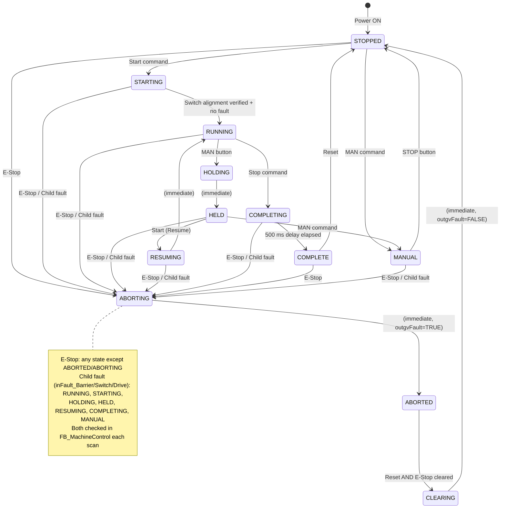
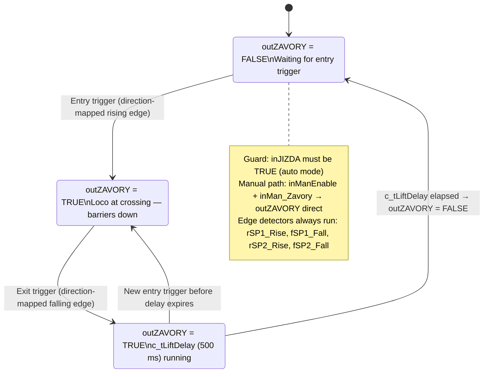
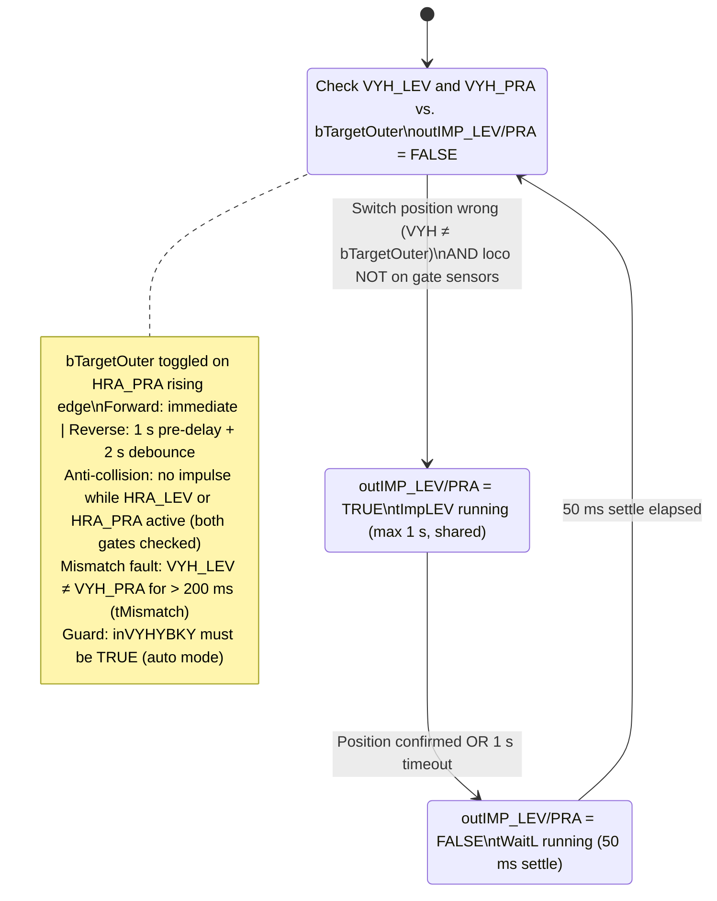

# REMIZ — Project Documentation
## Railway Model Automation — L4_kolejiste (Barrier & Switch Control)
### ŘPA Semester Project · TwinCAT 3 / Beckhoff

---

| Field | Value |
|---|---|
| **Project name** | REMIZ — Railway Model Control System |
| **Module** | L4_kolejiste — Barrier control (L4a) + Switch routing (L4b) |
| **PLC platform** | PC-based TwinCAT 3.1 (build 4024.62) — Intel Gigabit NIC as EtherCAT master |
| **PLC runtime port** | 854 |
| **Programming language** | IEC 61131-3 Structured Text (TwinCAT 3) |
| **SCADA** | mySCADA (via OPC UA / TF6100) |
| **Author** | Mykyta Zaizzhai |
| **Date** | 2026-05-12 |
| **AI model used** | Claude Sonnet 4.6 (claude-sonnet-4-6) |

---

## Table of Contents

1. [System Overview](#1-system-overview)
2. [Requirements — Automation Pyramid](#2-requirements--automation-pyramid)
   - 2.1 [Level 0 — Technology](#21-level-0--technology)
   - 2.2 [Level 1 — Field Instrumentation](#22-level-1--field-instrumentation)
   - 2.3 [Level 2 — Control (PLC)](#23-level-2--control-plc)
   - 2.4 [Level 3 — Supervisory (SCADA)](#24-level-3--supervisory-scada)
3. [I/O Tables](#3-io-tables)
   - 3.1 [Field-Level Signal Table](#31-field-level-signal-table)
   - 3.2 [PLC I/O Table (Control Level)](#32-plc-io-table-control-level)
   - 3.3 [SCADA Variables](#33-scada-variables)
4. [Operating States](#4-operating-states)
   - 4.1 [State Table (PackML)](#41-state-table-packml)
   - 4.2 [State Diagram](#42-state-diagram)
5. [Technology Sequences](#5-technology-sequences)
   - 5.1 [L4a — Barrier Control](#51-l4a--barrier-control)
   - 5.2 [L4b — Switch Routing](#52-l4b--switch-routing)
6. [Program Architecture](#6-program-architecture)
   - 6.1 [FB Decomposition](#61-fb-decomposition)
   - 6.2 [File Structure](#62-file-structure)
   - 6.3 [Variable Naming Conventions](#63-variable-naming-conventions)
   - 6.4 [Commented Source Code Reference](#64-commented-source-code-reference)
7. [OPC UA / SCADA Integration](#7-opc-ua--scada-integration)
8. [Cross-Reference](#8-cross-reference)
9. [Test Protocol](#9-test-protocol)
10. [AI Conversation Logs](#10-ai-conversation-logs)

---

## 1. System Overview

The REMIZ project automates a model railway layout (N-scale). Module **L4_kolejiste** controls two subsystems:

- **L4a — Barrier control:** Lowers and raises a level-crossing barrier based on locomotive presence. The sensor mapping is direction-aware: when driving forward (KLADNY), the left gate (HRA_LEV / SP1) is the entry trigger and the barrier gate (HRA_ZAV / SP2) is the exit trigger; in reverse (OPACNY) the mapping swaps. A 500 ms lift delay (`c_tLiftDelay`) prevents premature raising.
- **L4b — Switch routing:** Tracks a `bTargetOuter` flag toggled by a rising edge on the right gate sensor (HRA_PRA). Aligns the left (IMP_LEV) and right (IMP_PRA) double-track switches to the required position. The rear switch (IMP_ZAD) is operated in MANUAL mode only. Anti-collision: no impulse is issued while a locomotive occupies the gate sensors.

The system operates in modes: **AUTOMATION**, **MANUAL**. It follows the PackML state model (E_SystemState enum) using a dispatcher pattern: `FB_MachineControl` calls one state-specific FB per scan and acts on the `E_StateCmd` command returned. Status and control variables are exposed to mySCADA via OPC UA (TF6100).

No pneumatic actuators are used. All actuators are electromechanical (DC motor via relay, bistable solenoid impulse coils, barrier relay).


---

## 2. Requirements — Automation Pyramid

### 2.1 Level 0 — Technology

Physical components that perform work on the track layout:

| # | Component | Description |
|---|---|---|
| T-01 | Oval track (main loop) | Fixed N-scale single-track loop; energised when drive is active |
| T-02 | Double-track section | Short parallel segment (left side); inner/outer track selectable via switches |
| T-03 | Dead-end siding | De-energised branch; energised only when rear switch routes power there |
| T-04 | Locomotive (EMD GP38) | Single DC loco, 0–14 V, direction controlled by relay polarity |
| T-05 | Modelling transformer | Supplies 0–14 V DC to rails |
| T-06 | Level-crossing barriers | Electromechanical actuator; lowered/raised by relay output |
| T-07 | Left turnout solenoid | Bistable impulse solenoid; toggled by brief electrical pulse (≥ 25 ms) |
| T-08 | Right turnout solenoid | Bistable impulse solenoid; toggled by brief electrical pulse (≥ 25 ms) |
| T-09 | Rear turnout solenoid | Bistable impulse solenoid; toggled by brief electrical pulse (≥ 25 ms) |
| T-10 | Relay board | Interfaces EtherCAT DO terminals to track-level voltages |

### 2.2 Level 1 — Field Instrumentation

Requirements for sensors and actuators at the field level:

| # | Requirement | Sensor/Actuator |
|---|---|---|
| F-01 | Detect loco presence at left gate | HRA_LEV / SP1 (%IX1.1) |
| F-02 | Detect loco presence at right gate | HRA_PRA (%IX1.0) |
| F-03 | Detect loco presence at rear gate | HRA_ZAD (%IX1.2) |
| F-04 | Detect loco presence at barrier gate | HRA_ZAV / SP2 (%IX1.3) |
| F-05 | Read left switch position feedback | VYH_LEV (%IX0.0): 0=inner, 1=outer |
| F-06 | Read right switch position feedback | VYH_PRA (%IX0.1): 0=inner, 1=outer |
| F-07 | Read rear switch position feedback | VYH_ZAD (%IX0.2): 0=main, 1=siding |
| F-08 | Read operator direction selection | PRE_KLA (%IX0.3) / PRE_OPA (%IX0.4) |
| F-09 | Manual override buttons (3×) | TLA_LEV (%IX0.5) / TLA_PRA (%IX0.6) / TLA_ZAD (%IX0.7) |
| F-10 | Drive loco forward | DO5 — KLADNY (%QX0.5) |
| F-11 | Drive loco reverse | DO6 — OPACNY (%QX0.6) |
| F-12 | Lower / raise barriers | DO4 — ZAVORY (%QX0.4): 1=down |
| F-13 | Toggle left switch | DO7 — IMP_LEV (%QX0.7) |
| F-14 | Toggle right switch | DO8 — IMP_PRA (%QX1.0) |
| F-15 | Toggle rear switch | DO9 — IMP_ZAD (%QX1.1) |

### 2.3 Level 2 — Control (PLC)

| # | Requirement | Notes |
|---|---|---|
| C-01 | Execute L4a barrier control logic | `FB_Barrier`; state machine: IDLE → BLOCKED → LIFTING; direction-aware sensor mapping |
| C-02 | Execute L4b switch routing logic | `FB_SwitchRouter`; target tracked via `bTargetOuter`; edge on HRA_PRA triggers toggle |
| C-03 | Enforce drive mutual exclusion | KLADNY and OPACNY never simultaneously TRUE; `FB_DriveCtrl` enforces in both auto and manual |
| C-04 | Sequence switch impulses (one at a time) | Max 1 s timeout (`tImpLEV`, shared by both); 50 ms settle (`tWaitL`) after impulse |
| C-05 | Detect voltage fault (PRE_KLA AND PRE_OPA) | `FB_DriveCtrl` latches fault 16#0001, stops drive, triggers ABORTING |
| C-06 | Assert VYHYBKY on STARTING | `FB_State_Starting` asserts VYHYBKY (DO10) immediately, then checks VYH_LEV vs VYH_PRA: if mismatched, pulses **one** switch only (150 ms) → waits 120 ms → RUNNING; if already matched, transitions to RUNNING immediately |
| C-07 | Assert JIZDA in RUNNING | `FB_DriveCtrl.outJIZDA` → DO11; `FB_IO` also holds JIZDA during fault (`inForceJIZDA`) |
| C-08 | Expose status variables to supervisory level | `SCADA.TcGVL` with `{attribute 'OPC.UA.DA' := '1'}` pragmas |
| C-09 | Provide TwinCAT PLC Visualization (HMI) | `Visualization.TcVIS`: sensor lamps, fault banner, manual override buttons |
| C-10 | Run on Beckhoff TwinCAT 3 / EtherCAT | 10 ms scan cycle; IEC 61131-3 Structured Text |
| C-11 | AUTOMATION mode | Full automatic L4a + L4b cycle; `outEnable_Auto = TRUE` |
| C-12 | MANUAL mode | Individual actuator control via SCADA M101 variables and TLA_* hardware push-buttons; drive mutex active. All main operator buttons (START/STOP/RESET/MAN/E-STOP) are SCADA-only — no physical HW buttons wired. |
| C-14 | Standard button interface | START, RESET, STOP, MAN, E-STOP (combined HW + SCADA, ORed together) |
| C-15 | FDI diagnostics per drive circuit | Latched fault codes per FB; cleared only on CLEARING state |
| C-16 | E-STOP handling | SCADA_ESTOP software equivalent; HW NC input `inBTN_EStop` (TRUE = safe); any FALSE → ABORTING |

### 2.4 Level 3 — Supervisory (SCADA)

The supervisory level is implemented via **mySCADA** connected over OPC UA (TF6100).

| # | Requirement | Notes |
|---|---|---|
| S-01 | Expose system state (`systemstav`) | PackML state as WORD via `%MW106` |
| S-02 | Expose technology state (`techstav`) | High byte = L4a state, low byte = L4b state via `%MW104` |
| S-03 | SCADA equivalents of all operator buttons | `SCADA_START/RESET/STOP/MAN/ESTOP` at `%MX100.0`–`%MX100.4` |
| S-04 | SCADA manual actuator controls | `SCADA_MAN_KLADNY/OPACNY/ZAVORY/IMP_LEV/IMP_PRA/IMP_ZAD` at `%MX101.0`–`%MX101.5` |
| S-05 | OPC UA server on port 4840 | TF6100 standalone Configurator |
| S-06 | mySCADA remote server mapping | All `SCADA.*` variables exposed with `OPC.UA.DA` pragma |

---

## 3. I/O Tables

### 3.1 Field-Level Signal Table

#### Inputs (Sensors)

| Generic Name | Type | Physical Description | Active State | PLC Symbol | IO GVL |
|---|---|---|---|---|---|
| VYH_LEV | Digital Input | Left switch position feedback | 1 = outer track | VYH_LEV | DI0 |
| VYH_PRA | Digital Input | Right switch position feedback | 1 = outer track | VYH_PRA | DI1 |
| VYH_ZAD | Digital Input | Rear switch position feedback | 1 = siding | VYH_ZAD | DI2 |
| PRE_I / PRE_KLA | Digital Input | Operator direction — forward / switch position I | 1 = forward / pos I | PRE_KLA | DI3 |
| PRE_II / PRE_OPA | Digital Input | Operator direction — reverse / switch position II | 1 = reverse / pos II | PRE_OPA | DI4 |
| TLA_LEV | Digital Input | Manual push button — left switch | 1 = pressed | TLA_LEV | DI5 |
| TLA_PRA | Digital Input | Manual push button — right switch | 1 = pressed | TLA_PRA | DI6 |
| TLA_ZAD | Digital Input | Manual push button — rear switch | 1 = pressed | TLA_ZAD | DI7 |
| HRA_PRA | Digital Input | Optical gate — right (double-track exit) | 1 = loco present | HRA_PRA | DI8 |
| HRA_LEV / SP1 | Digital Input | Optical gate — left (double-track entry) | 1 = loco present | HRA_LEV | DI9 |
| HRA_ZAD | Digital Input | Optical gate — rear (siding area) | 1 = loco present | HRA_ZAD | DI10 |
| HRA_ZAV / SP2 | Digital Input | Optical gate — barrier crossing | 1 = loco present | HRA_ZAV | DI11 |

> **Note:** PRE_KLA AND PRE_OPA both TRUE simultaneously indicates rail voltage outside the allowed range (transformer protection tripped). `FB_DriveCtrl` raises fault 16#0001 on this condition.

#### Outputs (Actuators)

| Generic Name | Actuator | Type | Physical Description | Active State | PLC Symbol | IO GVL |
|---|---|---|---|---|---|---|
| ZAVORY / Z | B (Barriers) | Digital Output | Barrier relay | 1 = barriers DOWN | ZAVORY | DO4 |
| KLADNY | A (Loco drive) | Digital Output | Drive relay — forward polarity | 1 = forward drive | KLADNY | DO5 |
| OPACNY | A (Loco drive) | Digital Output | Drive relay — reverse polarity | 1 = reverse drive | OPACNY | DO6 |
| IMP_LEV | C (Left switch) | Digital Output | Left switch impulse solenoid | 1 = toggle pulse | IMP_LEV | DO7 |
| IMP_PRA | D (Right switch) | Digital Output | Right switch impulse solenoid | 1 = toggle pulse | IMP_PRA | DO8 |
| IMP_ZAD | E (Rear switch) | Digital Output | Rear switch impulse solenoid | 1 = toggle pulse | IMP_ZAD | DO9 |
| VYHYBKY | PLC ctrl | Digital Output | PLC asserts switch control | 1 = PLC owns switches | VYHYBKY | DO10 |
| JIZDA | PLC ctrl | Digital Output | PLC asserts drive control | 1 = PLC owns drive | JIZDA | DO11 |

> **Note:** KLADNY and OPACNY are mutually exclusive. IMP_LEV and IMP_PRA are impulse outputs — held HIGH for up to 1 s (`tImpLEV`, shared by both), followed by a 50 ms settle delay (`tWaitL`). Both left and right switch impulses are always issued together (parallel rail constraint). IMP_ZAD is only operated in MANUAL mode.

---

### 3.2 PLC I/O Table (Control Level)

#### EtherCAT Hardware

| Position | Module | Type | Description |
|---|---|---|---|
| Term 23 | EK1100 | EtherCAT coupler, 2A E-Bus | Connects EtherCAT fieldbus to terminal block |
| Term 24 | EL1008 | 8-channel DI, 24V, 3ms | Digital inputs %IX0.0–%IX0.7 (DI0–DI7) |
| Term 25 | EL1008 | 8-channel DI, 24V, 3ms | Digital inputs %IX1.0–%IX1.7 (DI8–DI11, rest unused) |
| Term 26 | EL2008 | 8-channel DO, 24V, 0.5A | Digital outputs %QX0.4–%QX1.3 (DO4–DO11, all 8 channels used) |
| Term 29 | EL9011 | End terminal | Bus termination |

> **EtherCAT master:** PC running TwinCAT 3.1 (build 4024.62) via Intel Gigabit NIC. AmsNetId: `169.254.109.136.3.1`.

Signals as declared in `IO.TcGVL` and aliased in `TAGS.TcGVL`, with EtherCAT addresses.

#### Digital Inputs

| PLC Symbol (TAGS) | IO GVL | EtherCAT Address | Description |
|---|---|---|---|
| VYH_LEV | DI0 | %IX0.0 | Left switch position (1=outer) |
| VYH_PRA | DI1 | %IX0.1 | Right switch position (1=outer) |
| VYH_ZAD | DI2 | %IX0.2 | Rear switch position (1=siding) |
| PRE_KLA (PRE_I) | DI3 | %IX0.3 | Operator: forward / switch pos I |
| PRE_OPA (PRE_II) | DI4 | %IX0.4 | Operator: reverse / switch pos II |
| TLA_LEV | DI5 | %IX0.5 | Manual button — left switch |
| TLA_PRA | DI6 | %IX0.6 | Manual button — right switch |
| TLA_ZAD | DI7 | %IX0.7 | Manual button — rear switch |
| HRA_PRA | DI8 | %IX1.0 | Right gate — loco present |
| HRA_LEV (SP1) | DI9 | %IX1.1 | Left gate — loco present |
| HRA_ZAD | DI10 | %IX1.2 | Rear gate — loco present |
| HRA_ZAV (SP2) | DI11 | %IX1.3 | Barrier gate — loco present |

#### Digital Outputs

| PLC Symbol (TAGS) | IO GVL | EtherCAT Address | Description |
|---|---|---|---|
| ZAVORY (Z) | DO4 | %QX0.4 | Barriers (1=DOWN) |
| KLADNY | DO5 | %QX0.5 | Drive forward |
| OPACNY | DO6 | %QX0.6 | Drive reverse |
| IMP_LEV | DO7 | %QX0.7 | Left switch impulse |
| IMP_PRA | DO8 | %QX1.0 | Right switch impulse |
| IMP_ZAD | DO9 | %QX1.1 | Rear switch impulse |
| VYHYBKY | DO10 | %QX1.2 | PLC owns switch control |
| JIZDA | DO11 | %QX1.3 | PLC owns drive control |

---

### 3.3 SCADA Variables

Variables exported to mySCADA via OPC UA (`SCADA.TcGVL`, attribute `{attribute 'OPC.UA.DA' := '1'}`).

#### Command Variables (SCADA → PLC)

| Variable | Address | Type | Description |
|---|---|---|---|
| `SCADA_START` | `%MX100.0` | BOOL | Start command |
| `SCADA_RESET` | `%MX100.1` | BOOL | Reset / clear fault |
| `SCADA_STOP` | `%MX100.2` | BOOL | Stop command |
| `SCADA_MAN` | `%MX100.3` | BOOL | Manual mode select |
| `SCADA_ESTOP` | `%MX100.4` | BOOL | Software E-STOP |
| `SCADA_MAN_KLADNY` | `%MX101.0` | BOOL | Manual: drive forward |
| `SCADA_MAN_OPACNY` | `%MX101.1` | BOOL | Manual: drive reverse |
| `SCADA_MAN_ZAVORY` | `%MX101.2` | BOOL | Manual: barriers down |
| `SCADA_MAN_IMP_LEV` | `%MX101.3` | BOOL | Manual: toggle left switch |
| `SCADA_MAN_IMP_PRA` | `%MX101.4` | BOOL | Manual: toggle right switch |
| `SCADA_MAN_IMP_ZAD` | `%MX101.5` | BOOL | Manual: toggle rear switch |

#### Status Variables (PLC → SCADA)

| Variable | Address | Type | Description |
|---|---|---|---|
| `techstav` | `%MW104` | WORD | Technology state — high byte = L4a, low byte = L4b |
| `systemstav` | `%MW106` | WORD | PackML system state (see Section 4.1) |

-


## 4. Operating States

### 4.1 State Table (PackML)

The system follows an ISA-88 PackML-inspired state model implemented via `E_SystemState` (WORD ENUM). `FB_MachineControl` dispatches to one active `FB_State_*` FB per scan; each state FB returns an `E_StateCmd` transition command.

| Value | State (E_SystemState) | What happens | How to enter |
|---|---|---|---|
| 0 | **STOPPED** | All outputs de-energised. KLADNY=0, OPACNY=0, ZAVORY=0. JIZDA and VYHYBKY not asserted. System safe and idle. | Power-on; CLEARING; COMPLETE + RESET; or MANUAL + STOP. |
| 1 | **STARTING** | VYHYBKY asserted immediately. Switch alignment is a **matching** operation: the goal is `VYH_LEV = VYH_PRA`, not any specific target position. If the two are already equal → done immediately. If they differ, the one currently in the *outer* position is pulsed (150 ms) → 120 ms settle → **closed-loop verify** (re-read VYH_LEV/VYH_PRA). If still mismatched, the sequence retries from the check; otherwise transitions to RUNNING. Only one solenoid is pulsed per attempt — this is consistent with the parallel-rail constraint of L4b, which forces both switches to move together *only when actively changing target position*; here the two switches are already on opposite sides, so a single pulse re-syncs them. `outEnable_Auto` stays **FALSE** throughout STARTING. | START command from STOPPED. |
| 2 | **RUNNING** | Normal automatic operation: L4a barrier control and L4b switch routing both active. Locomotive drives in selected direction. `outEnable_Auto = TRUE`. | STARTING completes without fault. |
| 3 | **HOLDING** | Transient — stops loco (placeholder for ramp-down sequencing). Immediately returns `TO_HELD`. | MAN command from RUNNING. |
| 4 | **HELD** | System paused. Drive stopped. Waiting for Resume or MAN. `outEnable_Auto = FALSE`, `outEnable_Man = FALSE`. | HOLDING completes. |
| 5 | **RESUMING** | Transient — restores drive direction (placeholder). Immediately returns `TO_RUNNING`. | RESUME (START) command from HELD. |
| 6 | **COMPLETING** | 500 ms delay (`c_tCompleteDelay = T#500MS`), then → COMPLETE. Drive stopped, barriers held in current state. | STOP command from RUNNING. |
| 7 | **COMPLETE** | All outputs off. System at rest. Awaiting RESET. | COMPLETING timer elapsed. |
| 8 | **ABORTING** | Immediate stop: all outputs de-energised. `outgvFault = TRUE`. Immediately returns `TO_ABORTED`. | E-STOP active OR child FB fault, from any state except ABORTED/ABORTING. |
| 9 | **ABORTED** | System halted. `outgvFault = TRUE` held. No outputs active. Requires operator RESET + E-STOP cleared. | ABORTING completes. |
| 10 | **CLEARING** | Transient — clears fault flag (`outgvFault = FALSE`), de-energises outputs, returns `TO_STOPPED`. One-scan `inClearFault` pulse clears child FB fault latches. | RESET from ABORTED after E-STOP cleared (`bEStop_Safe = TRUE`). |
| 11 | **MANUAL** | `outEnable_Man = TRUE`. Individual actuator commands passed from SCADA M101 variables and TLA_* push-buttons through `FB_DriveCtrl` (mutex active) and `FB_SwitchRouter` / `FB_Barrier` (manual path). Anti-collision not enforced in manual path. | MAN command from STOPPED or HELD. |

#### E-STOP Behaviour by State

| Current State | E-STOP action |
|---|---|
| RUNNING / HOLDING / HELD / STARTING / RESUMING / COMPLETING | Immediate de-energise all outputs → ABORTING |
| STOPPED / COMPLETE | All outputs already de-energised → ABORTING → ABORTED. Require RESET after E-STOP cleared. |
| MANUAL | Immediate de-energise all outputs → ABORTING |
| ABORTED / ABORTING | No additional action; already in fault state |

> E-STOP check has highest priority in `FB_MachineControl`. RESET from ABORTED is blocked while `inBTN_EStop = FALSE` or `SCADA_ESTOP = TRUE`.

**JIZDA (DO11) during E-STOP / fault:** KLADNY and OPACNY are de-energised, but **JIZDA stays asserted**. This is enforced by two mechanisms working together:
1. `FB_DriveCtrl`: when `bFault_latch = TRUE`, it explicitly sets `outJIZDA := TRUE` before de-energising drive outputs — the PLC keeps ownership of the drive circuit even while stopped.
2. `FB_IO`: `DO11 = inJIZDA OR inForceJIZDA`, where `inForceJIZDA := fbMachine.outgvFault` (TRUE during ABORTING / ABORTED). This provides a second path that holds JIZDA high regardless of `FB_DriveCtrl`'s output.

The effect: no external controller can claim drive control while the system is in a fault or E-STOP state.

#### FDI (Fault Detection and Isolation)

Fault codes are **per-FB** — the same numeric value has different meaning depending on which FB raises it. All fault latches are cleared by the one-scan `inClearFault` pulse that MAIN issues when the CLEARING state is entered (via `rClearing` R_TRIG).

| FB | Fault Code | Condition | Action |
|---|---|---|---|
| `FB_DriveCtrl` | 16#0001 | Voltage fault — PRE_KLA AND PRE_OPA both TRUE (transformer protection tripped) | Latch `outFault`; de-energise KLADNY/OPACNY; **keep `outJIZDA = TRUE`** (PLC retains drive ownership); trigger ABORTING from operational states (see child-fault list below) |
| `FB_DriveCtrl` | 16#0002 | Mutex fault — both auto commands (inKLADNY_cmd AND inOPACNY_cmd) TRUE simultaneously | **Reserved — currently unreachable.** In MAIN, `inKLADNY_cmd := outPRE_KLA AND …` and `inOPACNY_cmd := outPRE_OPA AND …`. Both can only be TRUE when PRE_KLA AND PRE_OPA are both TRUE, which triggers the voltage fault 16#0001 first. Kept as defence-in-depth for future wiring changes |
| `FB_Barrier` | — | No FDI raised in this layout (no barrier position sensor — barrier control is open-loop). Previously declared fault codes 16#0101 / 16#0102 and their timers have been removed | — |
| `FB_SwitchRouter` | 16#0003 | Switch mismatch: VYH_LEV ≠ VYH_PRA for longer than `tMismatch = 200 ms` | Latch `outFault`; trigger ABORTING |

**Child-fault routing.** `FB_MachineControl` promotes a child fault to ABORTING only when the active state is RUNNING, STARTING, HOLDING, HELD, RESUMING, COMPLETING, or MANUAL. Faults occurring in STOPPED / COMPLETE / ABORTING / ABORTED / CLEARING are not acted upon (system is already idle or already in fault handling).

---

### 4.2 State Diagram



> If Mermaid does not render, see the diagram image at: `[PLACEHOLDER: diagrams/state_machine.png]`

---

## 5. Technology Sequences

### 5.1 L4a — Barrier Control

Sequential logic for the barrier cycle. Implemented in `FB_Barrier`. The sensor used to trigger barrier lowering and raising depends on the current drive direction (KLADNY/OPACNY), making the barrier control direction-aware.

**Sensor mapping by direction:**

| Direction | Entry sensor (lower barriers) | Exit sensor (raise barriers) |
|---|---|---|
| KLADNY (forward) | SP1 / HRA_LEV — rising edge | SP2 / HRA_ZAV — falling edge |
| OPACNY (reverse) | SP2 / HRA_ZAV — rising edge | SP1 / HRA_LEV — falling edge |
| Unknown (neither) | Either SP1 or SP2 — rising edge (safe default) | SP1 **AND** SP2 — both falling edges required before raising |



**`techstav` high byte (`%MB105`) encoding:**

| Value | State |
|---|---|
| 0 | IDLE |
| 1 | BLOCKED |
| 2 | LIFTING |

**Constants:**

| Name | Value | Purpose |
|---|---|---|
| `c_tLiftDelay` | `T#500MS` | Delay after train clears before raising barriers |
| `c_tFDI_Timeout` | `T#3S` | Declared for future FDI use — not active (no position sensor) |

---

### 5.2 L4b — Switch Routing

Implemented in `FB_SwitchRouter`. Tracks a boolean `bTargetOuter` flag. The flag is toggled on a **rising edge of HRA_PRA** (right gate sensor):
- In forward mode (KLADNY): immediate toggle on HRA_PRA rising edge.
- In reverse mode (OPACNY): toggle with a 1 s pre-switch delay (`tPreSwitch`) followed by a 2 s debounce wait (`tDebounce`).

Both VYH_LEV and VYH_PRA switches are operated together (parallel rail constraint — switching one side requires switching the other). The rear switch (IMP_ZAD) is only operated in MANUAL mode.



**`techstav` low byte (`%MB104`) encoding:**

| Value | State |
|---|---|
| 0 | IDLE |
| 1 | IMPULSE (left + right simultaneously) |
| 2 | WAIT (50 ms settle) |

**Timers:**

| Name | Value | Purpose |
|---|---|---|
| `tImpLEV` | max 1 s | Impulse hold — shared by both IMP_LEV and IMP_PRA (fired together) |
| `tWaitL` | 50 ms | Post-impulse settle (both sides) |
| `tDebounce` | 2 s | Reverse-mode debounce wait after toggle |
| `tPreSwitch` | 1 s | Reverse-mode pre-switch delay before toggle |
| `tMismatch` | 200 ms | Mismatch fault timeout (VYH_LEV ≠ VYH_PRA) |

---

## 6. Program Architecture

### 6.1 FB Decomposition

The program uses a **dispatcher pattern**: `FB_MachineControl` instantiates one `FB_State_*` FB for each PackML state, calls all of them each scan (only the active one has `bExecute = TRUE`), and reads the `outCmd : E_StateCmd` returned to perform state transitions. Technology logic is fully isolated in `FB_Barrier`, `FB_SwitchRouter`, and `FB_DriveCtrl`. Physical I/O is accessed only through `FB_IO`.

```
MAIN (PRG)
│   Instances: fbIO, fbMachine, fbBarrier, fbSwitchRouter, fbDrive
│   R_TRIG rClearing — one-scan pulse on CLEARING entry → inClearFault to child FBs
│
├── FB_IO                      (* Single I/O access point: DI→named outputs, named inputs→DO *)
│   IN:  inKLADNY, inOPACNY, inZAVORY, inIMP_LEV/PRA/ZAD, inVYHYBKY, inJIZDA, inForceJIZDA
│   OUT: outVYH_LEV/PRA/ZAD, outPRE_KLA/OPA, outTLA_LEV/PRA/ZAD, outHRA_PRA/LEV/ZAD/ZAV
│   NOTE: DO11 (JIZDA) = inJIZDA OR inForceJIZDA (held during fault)
│
├── FB_MachineControl          (* PackML dispatcher: combines HW+SCADA inputs, E-STOP, calls state FBs *)
│   IN:  inBTN_Start/Reset/Stop/Man, inBTN_EStop (NC: TRUE=safe)
│        inSCADA_Start/Reset/Stop/Man/EStop (ORed with HW buttons)
│        inFault_Barrier/Switch/Drive: BOOL
│        inVYH_LEV/PRA (read by FB_State_Starting for switch alignment check)
│   OUT: outEnable_Auto, outEnable_Man, outServiceMode: BOOL
│        outState: E_SystemState, outgvFault: BOOL
│        outInit_VYHYBKY, outInit_IMP_LEV, outInit_IMP_PRA: BOOL (STARTING alignment signals)
│   Contains state FB instances (one per state, only active gets bExecute=TRUE):
│        fbStopped, fbStarting, fbRunning, fbHolding, fbHeld, fbResuming,
│        fbCompleting, fbComplete, fbAborting, fbAborted, fbClearing,
│        fbManual
│
├── FB_DriveCtrl               (* Loco drive — mutual exclusion + voltage fault FDI *)
│   IN:  inEnable, inClearFault, inKLADNY_cmd, inOPACNY_cmd
│        inPRE_KLA, inPRE_OPA, inMan_Kladny, inMan_Opacny
│   OUT: outKLADNY, outOPACNY, outJIZDA, outFault, outFaultCode
│   Execution order (each scan):
│     1. Clear fault latch if inClearFault
│     2. Detect voltage fault (PRE_KLA AND PRE_OPA → latch 16#0001)
│     3. If fault latched → outJIZDA=TRUE, outKLADNY/OPACNY=FALSE, RETURN
│        (PLC keeps drive ownership even while stopped — prevents external takeover)
│     4. If disabled (inEnable=FALSE) → all outputs FALSE, RETURN
│     5. Mutex on auto commands → latch 16#0002 if both TRUE (currently unreachable; see Sec 4.1)
│     6. Mutex on manual commands → suppress both silently (no fault)
│     7. Normal: outKLADNY = auto OR manual; outOPACNY = auto OR manual; outJIZDA=TRUE
│
├── FB_Barrier                 (* L4a — barrier control; direction-aware SP1/SP2 mapping *)
│   IN:  inEnable, inManEnable, inClearFault
│        inSP1 (HRA_LEV), inSP2 (HRA_ZAV), inKLADNY, inOPACNY, inJIZDA
│        inMan_Zavory
│   OUT: outZAVORY, outFault, outFaultCode, outTechstav: BYTE
│   Open-loop — no barrier position sensor; outFault always FALSE
│   (fault publishing infrastructure retained for interface uniformity)
│
└── FB_SwitchRouter            (* L4b — switch routing + FDI; bTargetOuter toggled on HRA_PRA edge *)
    IN:  inEnable, inManEnable, inVYHYBKY, inClearFault
         inVYH_LEV, inVYH_PRA, inHRA_LEV, inHRA_PRA
         inKLADNY, inOPACNY
         inMan_IMP_LEV/PRA/ZAD (TLA_* buttons OR SCADA M101)
    OUT: outIMP_LEV, outIMP_PRA, outIMP_ZAD, outFault, outFaultCode, outTechstav: BYTE
    Mismatch fault: VYH_LEV ≠ VYH_PRA for > tMismatch (200 ms)
```

#### State FB Interface Pattern

Each `FB_State_*` block shares the **same output interface** — `FB_MachineControl` reads these uniformly from every state FB each scan:

```pascal
VAR_OUTPUT
    outCmd          : E_StateCmd;   (* transition command; NONE = stay *)
    outEnable_Auto  : BOOL;
    outEnable_Man   : BOOL;
    outgvFault      : BOOL;
    outInit_VYHYBKY : BOOL;
    outInit_IMP_LEV : BOOL;
    outInit_IMP_PRA : BOOL;
END_VAR
```

Input interfaces differ — each FB declares only the inputs it actually uses:

| FB | Inputs beyond `bExecute` |
|---|---|
| `FB_State_Stopped` | `bStart`, `bMan` |
| `FB_State_Starting` | `inVYH_LEV`, `inVYH_PRA` |
| `FB_State_Running` | `bStop`, `bMan` |
| `FB_State_Holding` | *(none)* |
| `FB_State_Held` | `bStart`, `bMan` |
| `FB_State_Resuming` | *(none)* |
| `FB_State_Completing` | *(none)* |
| `FB_State_Complete` | `bReset` |
| `FB_State_Aborting` | *(none)* |
| `FB_State_Aborted` | `bReset`, `bEStop_Safe` |
| `FB_State_Clearing` | *(none)* |
| `FB_State_Manual` | `bStop` |

#### `E_StateCmd` — Transition Commands

```pascal
TYPE E_StateCmd :
(
    NONE          := 0,   (* Stay in current state *)
    TO_STOPPED    := 1,
    TO_STARTING   := 2,
    TO_RUNNING    := 3,
    TO_HOLDING    := 4,
    TO_HELD       := 5,
    TO_RESUMING   := 6,
    TO_COMPLETING := 7,
    TO_COMPLETE   := 8,
    TO_ABORTING   := 9,
    TO_ABORTED    := 10,
    TO_CLEARING   := 11,
    TO_MANUAL     := 12
);
END_TYPE
```

#### `FB_State_Starting` — Switch Alignment Steps

> **Note:** `outInit_VYHYBKY = TRUE` is asserted as a static output from the very first scan of STARTING (step 0). `outEnable_Auto` stays FALSE throughout — drive is not enabled until RUNNING.

| Step | Action | Timer |
|---|---|---|
| 0 | `outInit_VYHYBKY := TRUE` (immediate). Check VYH_LEV vs VYH_PRA: if equal (both already match each other) → step 5. If VYH_LEV=outer → step 1. If VYH_PRA=outer → step 3. | — |
| 1 | Pulse **IMP_LEV only** (`outInit_IMP_LEV = TRUE`) — toggles LEV solenoid | tImpulse = 150 ms |
| 2 | Wait for LEV switch travel, then re-read VYH_LEV/VYH_PRA: if aligned → step 5; otherwise → step 0 (retry) | tWait = 120 ms |
| 3 | Pulse **IMP_PRA only** (`outInit_IMP_PRA = TRUE`) — toggles PRA solenoid | tImpulse = 150 ms |
| 4 | Wait for PRA switch travel, then re-read: aligned → step 5, else → step 0 | tWait = 120 ms |
| 5 | Emit `TO_RUNNING` | — |

> **Key point:** Only ONE switch is pulsed per attempt — STARTING is a *matching* operation (`VYH_LEV = VYH_PRA`), not a *routing* operation. The L4b parallel-rail constraint requires both solenoids to fire together only when actively changing target position; for re-syncing two mismatched switches, a single pulse on the misaligned side is the correct response. Steps 2 and 4 close the loop by verifying the impulse actually moved the switch; if not, the sequence retries from step 0.

#### `techstav` Encoding (`%MW104`)

| Byte | Bits | Meaning |
|---|---|---|
| High byte `%MB105` | 0–7 | L4a barrier state: 0=IDLE, 1=BLOCKED, 2=LIFTING |
| Low byte `%MB104` | 0–7 | L4b switch state: 0=IDLE, 1=IMPULSE, 2=WAIT |

---

### 6.2 File Structure

```
L4_kolejiste/
├── GVLs/
│   ├── IO.TcGVL          (* Raw EtherCAT %IX0.0–%IX1.3 / %QX0.4–%QX1.3 addresses; DI0–DI11, DO4–DO11 *)
│   ├── TAGS.TcGVL        (* Human-readable signal aliases (VYH_LEV, HRA_PRA, KLADNY, etc.) *)
│   └── SCADA.TcGVL       (* M-variable declarations %MX100.0–%MW106 with OPC UA pragmas *)
├── POUs/
│   ├── MAIN.TcPOU                  (* Top-level PRG: FB instances, signal routing, techstav assembly *)
│   ├── FB_IO.TcPOU                 (* Single I/O access point: GVL_IO ↔ named ports *)
│   ├── FB_MachineControl.TcPOU    (* PackML dispatcher: E-STOP, fault routing, state FB calls *)
│   ├── FB_DriveCtrl.TcPOU         (* Drive mutual exclusion + voltage fault FDI *)
│   ├── FB_Barrier.TcPOU           (* L4a barrier state machine + FDI *)
│   ├── FB_SwitchRouter.TcPOU      (* L4b switch routing state machine + FDI *)
│   ├── FB_State_Stopped.TcPOU
│   ├── FB_State_Starting.TcPOU    (* Multi-step switch alignment on entry *)
│   ├── FB_State_Running.TcPOU
│   ├── FB_State_Holding.TcPOU     (* Transient — immediate TO_HELD *)
│   ├── FB_State_Held.TcPOU
│   ├── FB_State_Resuming.TcPOU    (* Transient — immediate TO_RUNNING *)
│   ├── FB_State_Completing.TcPOU  (* 500 ms delay then TO_COMPLETE *)
│   ├── FB_State_Complete.TcPOU
│   ├── FB_State_Aborting.TcPOU    (* Transient — immediate TO_ABORTED, outgvFault=TRUE *)
│   ├── FB_State_Aborted.TcPOU     (* Holds gvFault; blocks RESET until E-STOP cleared *)
│   ├── FB_State_Clearing.TcPOU    (* Transient — clears gvFault, TO_STOPPED *)
│   └── FB_State_Manual.TcPOU      (* Manual pass-through; STOP → STOPPED *)
├── DUTs/
│   ├── E_SystemState.TcDUT        (* ENUM WORD: PackML states 0–11 *)
│   └── E_StateCmd.TcDUT           (* ENUM: transition commands NONE/TO_STOPPED/…/TO_MANUAL *)
└── VISUs/
    └── Visualization.TcVIS        (* HMI: sensor lamps, state display, fault banner, manual buttons *)
```

---

### 6.3 Variable Naming Conventions

| Category | Convention | Examples |
|---|---|---|
| Physical inputs (IO GVL) | DIn (n = 0–11) | DI0 = VYH_LEV, DI9 = HRA_LEV, DI11 = HRA_ZAV |
| Physical outputs (IO GVL) | DOn (n = 4–11) | DO4 = ZAVORY, DO5 = KLADNY, DO10 = VYHYBKY |
| Tag aliases (TAGS GVL) | Czech function name | VYH_LEV, HRA_PRA, KLADNY, IMP_LEV, VYHYBKY, JIZDA |
| Dual aliases | Two names, same address | HRA_LEV / SP1, HRA_ZAV / SP2, PRE_KLA / PRE_I, ZAVORY / Z |
| FB inputs | `in` prefix | inEnable, inSP2, inKLADNY_cmd, inMan_Zavory |
| FB outputs | `out` prefix | outZAVORY, outFault, outFaultCode, outTechstav |
| State transition commands | `E_StateCmd.TO_*` | E_StateCmd.TO_RUNNING, E_StateCmd.NONE |
| SCADA variables | `SCADA_` prefix | SCADA_START, SCADA_MAN_KLADNY |
| State words | lowercase | techstav (%MW104), systemstav (%MW106) |
| Constants | `c_` prefix | c_tLiftDelay, c_tImpulseMax, c_tCompleteDelay |
| Internal state tracking | `b` prefix (BOOL) | bTargetOuter, bExecute |
| Timers | `t` prefix | tImpLEV, tWaitL, tDebounce, tPreSwitch, tMismatch |
| Edge detectors | `r` / `f` prefix | rSP1_Rise, fSP1_Fall, rClearing, rtrigHRA_PRA |

---

### 6.4 Commented Source Code Reference

The full source code is located in the TwinCAT project:

```
linka/L4_kolejiste/POUs/
```

Key files and their purpose:

| File | Description |
|---|---|
| [MAIN.TcPOU](linka/L4_kolejiste/POUs/MAIN.TcPOU) | Top-level PRG: FB instantiation, port wiring, techstav assembly, rClearing R_TRIG |
| [FB_IO.TcPOU](linka/L4_kolejiste/POUs/FB_IO.TcPOU) | Single point of physical I/O access; DO11 held via inForceJIZDA during fault |
| [FB_MachineControl.TcPOU](linka/L4_kolejiste/POUs/FB_MachineControl.TcPOU) | PackML dispatcher: E-STOP priority, child fault routing, all FB_State_* instances |
| [FB_DriveCtrl.TcPOU](linka/L4_kolejiste/POUs/FB_DriveCtrl.TcPOU) | Mutual exclusion; voltage fault (PRE_KLA AND PRE_OPA); latched fault codes 16#0001/0002 |
| [FB_Barrier.TcPOU](linka/L4_kolejiste/POUs/FB_Barrier.TcPOU) | L4a: direction-aware sensor mapping; states IDLE/BLOCKED/LIFTING; open-loop (no position sensor) |
| [FB_SwitchRouter.TcPOU](linka/L4_kolejiste/POUs/FB_SwitchRouter.TcPOU) | L4b: bTargetOuter toggled on HRA_PRA edge; parallel impulse on both switches; mismatch FDI |
| [FB_State_Starting.TcPOU](linka/L4_kolejiste/POUs/FB_State_Starting.TcPOU) | Closed-loop switch alignment — checks VYH_LEV vs VYH_PRA; if aligned jumps directly to done; if misaligned pulses one switch (LEV or PRA) for 150 ms, waits 120 ms, re-verifies VYH_LEV = VYH_PRA, retries from start if still mismatched |
| [FB_State_Manual.TcPOU](linka/L4_kolejiste/POUs/FB_State_Manual.TcPOU) | Manual pass-through; STOP edge → STOPPED |
| [FB_State_Completing.TcPOU](linka/L4_kolejiste/POUs/FB_State_Completing.TcPOU) | 500 ms graceful stop delay before COMPLETE |
| [FB_State_Clearing.TcPOU](linka/L4_kolejiste/POUs/FB_State_Clearing.TcPOU) | Clears outgvFault and transitions immediately to STOPPED |
| [E_SystemState.TcDUT](linka/L4_kolejiste/DUTs/E_SystemState.TcDUT) | ENUM WORD: PackML state values 0–11 |
| [E_StateCmd.TcDUT](linka/L4_kolejiste/DUTs/E_StateCmd.TcDUT) | ENUM: transition commands returned by each FB_State_* to the dispatcher |
| [SCADA.TcGVL](linka/L4_kolejiste/GVLs/SCADA.TcGVL) | SCADA M-variable declarations with `{attribute 'OPC.UA.DA' := '1'}` pragmas |
| [IO.TcGVL](linka/L4_kolejiste/GVLs/IO.TcGVL) | Raw EtherCAT AT addresses: DI0–DI11 (%IX0.0–%IX1.3), DO4–DO11 (%QX0.4–%QX1.3) |
| [TAGS.TcGVL](linka/L4_kolejiste/GVLs/TAGS.TcGVL) | Symbolic aliases including dual-name declarations (SP1/HRA_LEV, PRE_I/PRE_KLA, etc.) |

> See each file for inline comments explaining state transitions, guard conditions, and timing constants.

---

## 7. OPC UA / SCADA Integration

OPC UA connectivity uses **TF6100 OPC-UA Server** with the standalone **TwinCAT OPC UA Configurator** application. The SCADA frontend is **mySCADA**.

### Setup Summary

1. Activate TF6100 license in TwinCAT XAE (SYSTEM → License)
2. Install and open the standalone **TwinCAT OPC UA Configurator**
3. Create a server instance — port **4840**, security: **None / Anonymous**
4. Point the server to the compiled `.tcm` file of L4_kolejiste (Port 854)
5. Verify SCADA namespace shows all `PLC1.SCADA.*` variables
6. Open port 4840 TCP inbound in Windows Firewall
7. In mySCADA: add OPC UA remote server → `opc.tcp://<plc-ip>:4840`
8. Map variables to mySCADA tags (see table below)

> Full step-by-step procedure: see [OPC_UA_SETUP.md](OPC_UA_SETUP.md)

### OPC UA Node ID Mapping

| mySCADA Tag | OPC UA Node ID | PLC Address |
|---|---|---|
| START | `ns=2;s=PLC1.SCADA.SCADA_START` | `%MX100.0` |
| RESET | `ns=2;s=PLC1.SCADA.SCADA_RESET` | `%MX100.1` |
| STOP | `ns=2;s=PLC1.SCADA.SCADA_STOP` | `%MX100.2` |
| MAN | `ns=2;s=PLC1.SCADA.SCADA_MAN` | `%MX100.3` |
| E-STOP | `ns=2;s=PLC1.SCADA.SCADA_ESTOP` | `%MX100.4` |
| MAN_KLADNY | `ns=2;s=PLC1.SCADA.SCADA_MAN_KLADNY` | `%MX101.0` |
| MAN_OPACNY | `ns=2;s=PLC1.SCADA.SCADA_MAN_OPACNY` | `%MX101.1` |
| MAN_ZAVORY | `ns=2;s=PLC1.SCADA.SCADA_MAN_ZAVORY` | `%MX101.2` |
| MAN_IMP_LEV | `ns=2;s=PLC1.SCADA.SCADA_MAN_IMP_LEV` | `%MX101.3` |
| MAN_IMP_PRA | `ns=2;s=PLC1.SCADA.SCADA_MAN_IMP_PRA` | `%MX101.4` |
| MAN_IMP_ZAD | `ns=2;s=PLC1.SCADA.SCADA_MAN_IMP_ZAD` | `%MX101.5` |
| techstav | `ns=2;s=PLC1.SCADA.techstav` | `%MW104` |
| systemstav | `ns=2;s=PLC1.SCADA.systemstav` | `%MW106` |

---

## 8. Cross-Reference

Full cross-reference exported from TwinCAT XAE: **[cross references.pdf](cross%20references.pdf)**

The cross-reference verifies:
- `FB_IO` is the **only** block that reads `IO.TcGVL` raw addresses
- `SCADA.systemstav` and `SCADA.techstav` are written only from `FB_MachineControl` and `MAIN`
- `outgvFault` propagation: set in `FB_State_Aborting/Aborted` (via `outgvFault := TRUE`), cleared in `FB_State_Clearing`; forwarded by `FB_MachineControl.outgvFault` → `MAIN.inForceJIZDA` (which holds DO11 / JIZDA high via `FB_IO`). `FB_DriveCtrl` no longer publishes an `outgvFault` of its own — drive-fault routing to MachineControl uses `FB_DriveCtrl.outFault` exclusively.
- `inClearFault` pulse: generated by `rClearing` R_TRIG in MAIN; passed to `FB_DriveCtrl`, `FB_Barrier`, `FB_SwitchRouter`

---

## 9. Test Protocol

> **Test results to be filled in after testing session on `[PLACEHOLDER: date]`.**

### Prerequisites

- TwinCAT XAE open, `linka/linka.tsproj` loaded
- Device in **Simulation Mode** (or connected to real hardware)
- Configuration activated, PLC running
- Watch window open with: `fbMachine.outState`, `SCADA.systemstav`, `SCADA.techstav`, `IO.DO4`–`IO.DO11`, `fbDrive.outFault`, `fbDrive.outFaultCode`, `fbBarrier.outFault`, `fbSwitchRouter.outFault`, `fbSwitchRouter.bTargetOuter`
- In MAIN: `inBTN_EStop := TRUE` (NC wired safe; simulation default)

### Results

#### Test 1 — Power-on / Initial State

| Step | Action | Expected | Result | Pass? |
|---|---|---|---|---|
| 1.1 | Activate config, start PLC, no inputs forced | `SCADA.systemstav = 0` (STOPPED) | | x|
| 1.2 | Check DO4–DO11 | All FALSE | |x |
| 1.3 | Check `SCADA.techstav` | 0x0000 | | x|

#### Test 2 — AUTO Start: switch alignment in STARTING

> STARTING is **closed-loop**: after each impulse + 120 ms settle, the FB re-reads VYH_LEV and VYH_PRA; if still mismatched it retries the pulse, otherwise it transitions to RUNNING. In simulation you must manually toggle the DI to mimic the physical switch movement during the settle window, otherwise STARTING will loop forever.

| Step | Action | Expected | Result | Pass? |
|---|---|---|---|---|
| 2.1 | Set DI0=TRUE, DI1=FALSE (VYH_LEV=outer, VYH_PRA=inner — mismatched). Pulse `SCADA_START` | `systemstav → 1` (STARTING); DO10=TRUE immediately | |x |
| 2.2 | Observe DO7 (IMP_LEV) | TRUE for ~150 ms, then FALSE; DO8 stays FALSE throughout | | x|
| 2.3 | While DO7=FALSE and within the 120 ms settle window: force DI0=FALSE (simulate LEV switch moving to inner) | After settle, verification passes (DI0=DI1=FALSE) → `systemstav → 2` (RUNNING); DO11=TRUE | | x|
| 2.4 | Reset to STOPPED. Set DI0=FALSE, DI1=TRUE (mismatched the other way). Pulse `SCADA_START` | DO7 stays FALSE; DO8=TRUE for ~150 ms, then FALSE | | x|
| 2.5 | During settle: force DI1=FALSE | Verification passes → RUNNING | | x|
| 2.6 | Verify retry path: repeat 2.1 but do **not** toggle DI0 during settle | After 270 ms, DO7 pulses **again** (step 0 → step 1 retry); system stays in STARTING | | x|
| 2.7 | Set DI0=DI1 (already matched). Pulse `SCADA_START` | No impulse on DO7 or DO8 — STARTING transitions to RUNNING immediately | | x|

#### Test 3 — AUTO Stop cycle (COMPLETING delay)

| Step | Action | Expected | Result | Pass? |
|---|---|---|---|---|
| 3.1 | In RUNNING, pulse `SCADA_STOP` | systemstav → 6 (COMPLETING) | | x|
| 3.2 | Wait 500 ms | systemstav → 7 (COMPLETE); DO5, DO6=FALSE | |x |
| 3.3 | Pulse `SCADA_RESET` | systemstav → 0 (STOPPED) | |x |

#### Test 4 — Barrier control L4a (forward direction)

> Forward: KLADNY=TRUE. Entry = SP1/HRA_LEV (DI9). Exit = SP2/HRA_ZAV (DI11) falling edge.

| Step | Action | Expected | Result | Pass? |
|---|---|---|---|---|
| 4.1 | RUNNING, DI3=TRUE (PRE_KLA forward), DO4=FALSE | techstav high byte = 0 (IDLE) | | x|
| 4.2 | Set DI9=TRUE (HRA_LEV rising edge) | techstav high → 1 (BLOCKED); DO4=TRUE | |x |
| 4.3 | Set DI11=FALSE (HRA_ZAV falling edge — loco cleared) | techstav high → 2 (LIFTING); DO4 still TRUE | | x|
| 4.4 | Wait 500 ms (`c_tLiftDelay`) | techstav high → 0 (IDLE); DO4=FALSE | | x|
| 4.5 | Repeat 4.2, then during LIFTING set DI9=TRUE again | techstav high → 1 (BLOCKED — re-arms barrier) | | x|
| 4.6 | DI9=FALSE → DI11 falling edge, wait 500 ms | techstav high → 0 (IDLE) | | x|

#### Test 5 — Barrier control L4a (reverse direction)

> Reverse: OPACNY=TRUE. Entry = SP2/HRA_ZAV (DI11). Exit = SP1/HRA_LEV (DI9) falling edge.

| Step | Action | Expected | Result | Pass? |
|---|---|---|---|---|
| 5.1 | RUNNING, DI4=TRUE (PRE_OPA reverse) | techstav high = 0 (IDLE), DO4=FALSE | | x|
| 5.2 | Set DI11=TRUE (HRA_ZAV rising edge) | techstav high → 1 (BLOCKED); DO4=TRUE | | x|
| 5.3 | Set DI9=FALSE (HRA_LEV falling edge) | techstav high → 2 (LIFTING); DO4 still TRUE | | x|
| 5.4 | Wait 500 ms | techstav high → 0 (IDLE); DO4=FALSE | | x|

#### Test 6 — Switch routing L4b: impulse + settle

| Step | Action | Expected | Result | Pass? |
|---|---|---|---|---|
| 6.1 | RUNNING, bTargetOuter=TRUE, set DI0=FALSE / DI1=FALSE (inner=wrong) | techstav low → 1 (IMPULSE); DO7+DO8=TRUE simultaneously | | x|
| 6.2 | Set DI0=TRUE, DI1=TRUE (position confirmed during impulse) | DO7+DO8=FALSE; techstav low → 2 (WAIT) | | x|
| 6.3 | Wait 50 ms settle | techstav low → 0 (IDLE) | | x|
| 6.4 | DI0=TRUE, DI1=TRUE, bTargetOuter=TRUE (already correct) | techstav low stays 0, no impulse outputs | | x|


#### Test 7 — Manual mode

| Step | Action | Expected | Result | Pass? |
|---|---|---|---|---|
| 7.1 | Pulse `SCADA_MAN` from STOPPED | systemstav → 11 (MANUAL) | |x |
| 7.2 | `SCADA_MAN_ZAVORY=TRUE` | DO4=TRUE | | x|
| 7.3 | `SCADA_MAN_ZAVORY=FALSE` | DO4=FALSE | |x |
| 7.4 | `SCADA_MAN_KLADNY=TRUE` | DO5=TRUE | | x|
| 7.5 | `SCADA_MAN_OPACNY=TRUE` while KLADNY still TRUE | Both DO5+DO6=FALSE (manual mutex in `FB_DriveCtrl`) | | x|
| 7.6 | `SCADA_MAN_KLADNY=FALSE`, `SCADA_MAN_OPACNY=TRUE` | DO6=TRUE | | x|
| 7.7 | `SCADA_MAN_IMP_LEV=TRUE` | DO7=TRUE AND DO8=TRUE simultaneously (parallel rail constraint) | |x |
| 7.8 | Pulse `SCADA_STOP` | systemstav → 0 (STOPPED) | | x|

#### Test 8 — E-STOP from RUNNING + JIZDA behavior

| Step | Action | Expected | Result | Pass? |
|---|---|---|---|---|
| 8.1 | Confirm RUNNING, DO11=TRUE | systemstav=2 | | x|
| 8.2 | Set `SCADA_ESTOP=TRUE` | systemstav → 8 (ABORTING) → 9 (ABORTED) | | x|
| 8.3 | Check DO4, DO5, DO6 | All FALSE | | x|
| 8.4 | Check DO11 (JIZDA) | **TRUE** — PLC retains drive ownership via `inForceJIZDA` | | x|
| 8.5 | Pulse `SCADA_RESET` while ESTOP still TRUE | systemstav stays 9 | |x |
| 8.6 | Set `SCADA_ESTOP=FALSE`, pulse `SCADA_RESET` | systemstav → 10 (CLEARING) → 0 (STOPPED); DO11=FALSE | | x|


#### Test 9 — HOLD / RESUME

| Step | Action | Expected | Result | Pass? |
|---|---|---|---|---|
| 9.1 | Confirm RUNNING | systemstav=2 | | x|
| 9.2 | Pulse `SCADA_MAN` | systemstav → 3 (HOLDING) → 4 (HELD) | | x|
| 9.3 | Check DO5, DO6 | FALSE (drive stopped) | | x|
| 9.4 | Check DO10, DO11 | Both still TRUE | | x|
| 9.5 | Pulse `SCADA_START` (Resume) | systemstav → 5 (RESUMING) → 2 (RUNNING) | | x|

#### Test 10 — HELD → MANUAL transition

| Step | Action | Expected | Result | Pass? |
|---|---|---|---|---|
| 10.1 | Reach HELD  | systemstav=4 | | x|
| 10.2 | Pulse `SCADA_MAN` | systemstav → 11 (MANUAL) | |x |
| 10.3 | Confirm `outEnable_Man=TRUE` | Manual commands active | |x|

### Summary

| Test | Description | Pass? | Notes |
|---|---|---|---|
| 1 | Power-on safe state | x | |
| 2 | STARTING switch alignment (closed-loop, matched / mismatched / retry) | x | |
| 3 | AUTO stop — COMPLETING 500 ms delay | x | |
| 4 | Barrier L4a — forward direction sequence | x | |
| 5 | Barrier L4a — reverse direction sequence | x | |
| 6 | Switch routing L4b — impulse + settle | x | |
| 7 | Manual mode — barriers, drive mutex, parallel switch impulse | x | |
| 8 | E-STOP from RUNNING — JIZDA stays TRUE | x | |
| 9 | HOLD / RESUME cycle | x | |
| 10 | HELD → MANUAL transition | x | |

> **Tester:** `[Mykyta Zaizzhai]`  
> **Date:** `[11.05.2026]`  
> **TwinCAT build:** 4024.62

---

## 10. AI Conversation Logs

Per project requirements (*"Součástí dokumentace jsou kompletní konverzace + datum a použitý model"*), all AI-assisted generation is documented here.

---

### Conversation 1 — Requirements & Diagrams Generation

> **`[PLACEHOLDER]`**
>
> - **Date:** `[PLACEHOLDER: e.g. 2026-04-XX]`
> - **Model:** `[PLACEHOLDER: e.g. Claude Sonnet 4.5]`
> - **Tool:** `[PLACEHOLDER: e.g. Claude.ai / Claude Code]`
> - **Content generated:** Requirements tables, automation pyramid, I/O tables, PackML state table, state diagrams (Mermaid), technology sequence diagrams, program architecture description
>
> Paste full conversation below:
> ```
> [PASTE FULL CONVERSATION HERE]
> ```

---

### Conversation 2 — OPC UA Setup & Documentation

> - **Date:** 2026-05-08
> - **Model:** Claude Sonnet 4.6 (claude-sonnet-4-6)
> - **Tool:** Claude Code (VSCode extension)
> - **Content generated:** OPC UA setup rewrite for standalone TwinCAT OPC UA Configurator + mySCADA workflow, initial DOCUMENTATION.md
>
> Paste full conversation below:
> ```
> [PASTE FULL CONVERSATION HERE — export from Claude Code session]
> ```

---

### Conversation 3 — Documentation Rewrite (Code-Accurate)

> - **Date:** 2026-05-12
> - **Model:** Claude Sonnet 4.6 (claude-sonnet-4-6)
> - **Tool:** Claude Code (VSCode extension)
> - **Content generated:** Full documentation rewrite based on actual source code reading — corrected I/O addresses, FB decomposition (dispatcher pattern + FB_State_* blocks), direction-aware FB_Barrier, bTargetOuter logic in FB_SwitchRouter, E_StateCmd enum, FB_State_Starting switch alignment, real constants and timers, updated test protocol (Tests 9–10 added)
>
> Paste full conversation below:
> ```
> [PASTE FULL CONVERSATION HERE — export from Claude Code session]
> ```

---

*REMIZ Project Documentation · TwinCAT 3 / Beckhoff · L4_kolejiste · Tasks L4a & L4b*  
*Generated with AI assistance (Claude Sonnet 4.6) · 2026-05-12*
