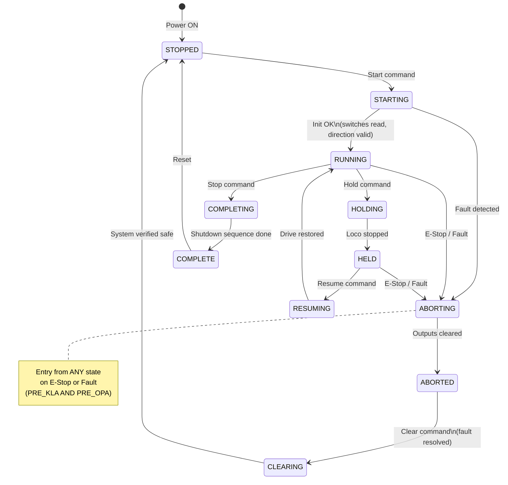
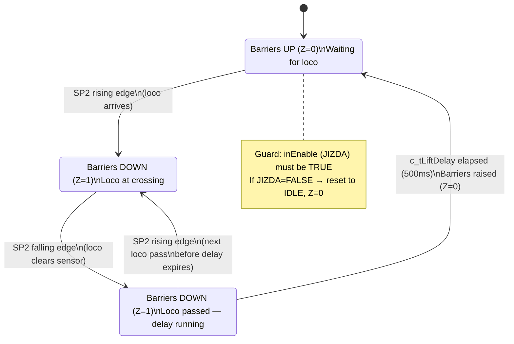
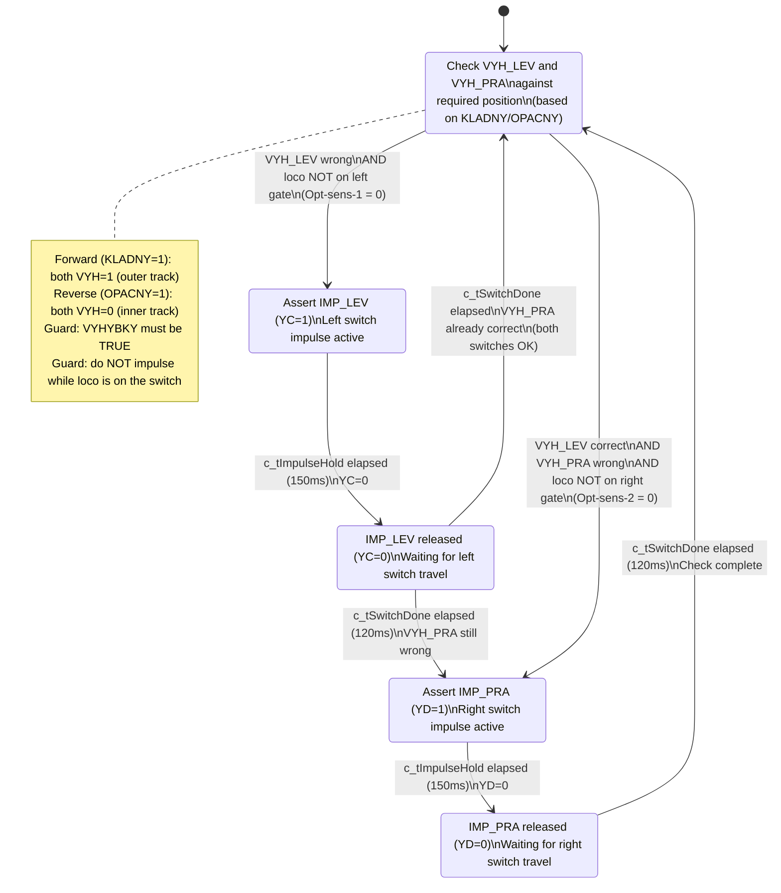

# REMIZ — System Requirements & Diagrams
## Tasks L4a (Barrier Control) & L4b (Switch Routing)

---

## 1. System Requirements — Automation Pyramid

### Level 0 — Technology (Process / Physical)

The physical technology layer comprises all mechanical and electrical components that directly perform work on the track layout:

| # | Component | Description |
|---|---|---|
| T-01 | Oval track (main loop) | Fixed N-scale single-track loop; continuously energised when drive is active |
| T-02 | Double-track section | Short parallel segment (left side); inner/outer track selectable via switches |
| T-03 | Dead-end siding | De-energised branch; energised only when rear switch routes power there |
| T-04 | Locomotive (EMD GP38) | Single DC loco, 0–14 V, direction controlled by relay polarity |
| T-05 | Modelling transformer | Supplies 0–14 V DC to rails; voltage-monitoring relay cuts power on fault |
| T-06 | Level-crossing barriers | Electromechanical barrier actuator; lowered/raised by relay output |
| T-07 | Left turnout solenoid | Bistable impulse solenoid; toggle by brief electrical pulse |
| T-08 | Right turnout solenoid | Bistable impulse solenoid; toggle by brief electrical pulse |
| T-09 | Rear turnout solenoid | Bistable impulse solenoid; toggle by brief electrical pulse |
| T-10 | Relay board | Interfaces EtherCAT DO terminals to track-level voltages |

### Level 1 — Field Instrumentation (Sensors & Actuators)

All physical sensors and actuators. Named using the A/B/C/... actuator convention and typed sensor names.

**Requirements:**

| # | Requirement | Element |
|---|---|---|
| F-01 | Detect loco presence at left gate | Opt-sens-1 (SP1 / HRA_LEV) |
| F-02 | Detect loco presence at right gate | Opt-sens-2 (HRA_PRA) |
| F-03 | Detect loco presence at rear gate | Opt-sens-3 (HRA_ZAD) |
| F-04 | Detect loco presence at barrier crossing | Opt-sens-4 (SP2 / HRA_ZAV) |
| F-05 | Read left switch position feedback | Pos-sens-C (VYH_LEV): 0=inner, 1=outer |
| F-06 | Read right switch position feedback | Pos-sens-D (VYH_PRA): 0=inner, 1=outer |
| F-07 | Read rear switch position feedback | Pos-sens-E (VYH_ZAD): 0=main, 1=siding |
| F-08 | Read operator direction selection | Dir-sens-A (PRE_KLA / PRE_OPA) |
| F-09 | Manual override buttons (3×) | Push-btn-C, Push-btn-D, Push-btn-E (TLA_LEV/PRA/ZAD) |
| F-10 | Drive loco forward | Actuator A, output YA1 (KLADNY) |
| F-11 | Drive loco reverse | Actuator A, output YA0 (OPACNY) |
| F-12 | Lower / raise barriers | Actuator B, output YB (ZAVORY): 1=down, 0=up |
| F-13 | Toggle left switch | Actuator C, impulse output YC (IMP_LEV) |
| F-14 | Toggle right switch | Actuator D, impulse output YD (IMP_PRA) |
| F-15 | Toggle rear switch | Actuator E, impulse output YE (IMP_ZAD) |

> **Note on pneumatics:** This system contains no pneumatic actuators. The original task template (electro-pneumatic schematic with bistable valve) does not apply. All actuators are electromechanical (DC motor via relay, solenoid impulse, barrier relay). A formal electro-pneumatic schematic is therefore omitted; the field instrumentation is described in the signal tables below.

### Level 2 — Control (PLC)

| # | Requirement | Notes |
|---|---|---|
| C-01 | Execute L4a barrier control logic | FB_Barrier; state machine: IDLE → BLOCKED → LIFTING |
| C-02 | Execute L4b switch routing logic | FB_SwitchRouter; state machine: IDLE → IMPULSE_x → WAIT_x |
| C-03 | Enforce drive mutual exclusion | KLADNY and OPACNY never simultaneously TRUE |
| C-04 | Sequence switch impulses (one at a time) | Impulse hold ≥ 150 ms; wait for travel before next |
| C-05 | Detect voltage fault (PRE_KLA AND PRE_OPA) | Enter fault state; stop drive; flag gvFault |
| C-06 | Assert VYHYBKY on startup | PLC takes switch control before any routing |
| C-07 | Assert JIZDA on startup | PLC takes drive control in automated mode |
| C-08 | Expose status variables for supervisory level | Via GVL shared variables (see Section 1.4) |
| C-09 | Provide TwinCAT PLC Visualization (HMI) | VIS_Main.TcVIS: sensor lamps, fault banner, manual override |
| C-10 | Run on Beckhoff TwinCAT 3 / EtherCAT | 10 ms scan cycle; IEC 61131-3 Structured Text |

### Level 3 — Supervisory (SCADA) — Context Reference

The REMIZ lab setup does not implement a full SCADA system. Level 3 is referenced here for completeness and to define which variables would be published upward. A TwinCAT PLC Visualization (Level 2 HMI) serves as the practical monitoring interface in the lab.

---

## 1.2 Field-Level I/O Signal Table

Signals as seen at **Level 1 — Field Instrumentation**, using generic actuator/sensor naming.

### Inputs (Sensors → Field level)

| Generic Name | Type | Physical Description | Active State | PLC Symbol |
|---|---|---|---|---|
| Opt-sens-1 | Digital Input | Optical gate — left (double-track entry) | 1 = loco present | SP1 / HRA_LEV |
| Opt-sens-2 | Digital Input | Optical gate — right (double-track exit) | 1 = loco present | HRA_PRA |
| Opt-sens-3 | Digital Input | Optical gate — rear (siding area) | 1 = loco present | HRA_ZAD |
| Opt-sens-4 | Digital Input | Optical gate — barrier crossing | 1 = loco present | SP2 / HRA_ZAV |
| Pos-sens-C | Digital Input | Left switch position feedback | 1 = outer track | VYH_LEV |
| Pos-sens-D | Digital Input | Right switch position feedback | 1 = outer track | VYH_PRA |
| Pos-sens-E | Digital Input | Rear switch position feedback | 1 = siding | VYH_ZAD |
| Dir-sens-A-fwd | Digital Input | Operator direction switch — forward | 1 = forward selected | PRE_KLA |
| Dir-sens-A-rev | Digital Input | Operator direction switch — reverse | 1 = reverse selected | PRE_OPA |
| Push-btn-C | Digital Input | Manual push button — left switch | 1 = pressed | TLA_LEV |
| Push-btn-D | Digital Input | Manual push button — right switch | 1 = pressed | TLA_PRA |
| Push-btn-E | Digital Input | Manual push button — rear switch | 1 = pressed | TLA_ZAD |

### Outputs (Field level → Actuators)

| Generic Name | Actuator | Type | Physical Description | Active State | PLC Symbol |
|---|---|---|---|---|---|
| YA1 | A (Loco drive) | Digital Output | Drive relay — forward polarity | 1 = forward drive | KLADNY |
| YA0 | A (Loco drive) | Digital Output | Drive relay — reverse polarity | 1 = reverse drive | OPACNY |
| YB | B (Barriers) | Digital Output | Barrier relay | 1 = barriers DOWN | Z / ZAVORY |
| YC | C (Left switch) | Digital Output | Left switch impulse solenoid | 1 = toggle (pulse) | IMP_LEV |
| YD | D (Right switch) | Digital Output | Right switch impulse solenoid | 1 = toggle (pulse) | IMP_PRA |
| YE | E (Rear switch) | Digital Output | Rear switch impulse solenoid | 1 = toggle (pulse) | IMP_ZAD |

> **Note:** YA1 and YA0 are mutually exclusive — both TRUE simultaneously is a hardware fault condition.  
> **Note:** YC, YD, YE are impulse outputs. They must be held HIGH for ≥ 150 ms (c_tImpulseHold) and released. Only one may be active at a time.

### Internal PLC Control Outputs (takeover flags)

| Generic Name | Type | Description | Active State | PLC Symbol |
|---|---|---|---|---|
| PLC-ctrl-drive | Digital Output | PLC asserts drive control | 1 = PLC owns drive | JIZDA |
| PLC-ctrl-switch | Digital Output | PLC asserts switch control | 1 = PLC owns switches | VYHYBKY |

---

## 1.3 PLC-Level I/O Table (Control Level — GVL_IO)

Signals as declared in `GVL_IO.TcGVL`, with EtherCAT addresses and cross-reference to field names.

### Digital Inputs

| PLC Symbol | EtherCAT Address | Direction | Field Signal | Description |
|---|---|---|---|---|
| SP1 / HRA_LEV | %IX1.1 | Input | Opt-sens-1 | Left gate — loco present |
| HRA_PRA | %IX1.0 | Input | Opt-sens-2 | Right gate — loco present |
| HRA_ZAD | %IX1.2 | Input | Opt-sens-3 | Rear gate — loco present |
| SP2 / HRA_ZAV | %IX1.3 | Input | Opt-sens-4 | Barrier gate — loco present |
| VYH_LEV | %IX0.0 | Input | Pos-sens-C | Left switch position (1=outer) |
| VYH_PRA | %IX0.1 | Input | Pos-sens-D | Right switch position (1=outer) |
| VYH_ZAD | %IX0.2 | Input | Pos-sens-E | Rear switch position (1=siding) |
| PRE_KLA | %IX0.3 | Input | Dir-sens-A-fwd | Operator: forward selected |
| PRE_OPA | %IX0.4 | Input | Dir-sens-A-rev | Operator: reverse selected |
| TLA_LEV | %IX0.5 | Input | Push-btn-C | Manual button — left switch |
| TLA_PRA | %IX0.6 | Input | Push-btn-D | Manual button — right switch |
| TLA_ZAD | %IX0.7 | Input | Push-btn-E | Manual button — rear switch |

### Digital Outputs

| PLC Symbol | EtherCAT Address | Direction | Field Signal | Description |
|---|---|---|---|---|
| KLADNY | %QX0.5 | Output | YA1 | Drive forward |
| OPACNY | %QX0.6 | Output | YA0 | Drive reverse |
| Z / ZAVORY | %QX0.4 | Output | YB | Barriers (1=DOWN) |
| IMP_LEV | %QX0.7 | Output | YC | Left switch impulse |
| IMP_PRA | %QX1.0 | Output | YD | Right switch impulse |
| IMP_ZAD | %QX1.1 | Output | YE | Rear switch impulse |
| VYHYBKY | %QX1.2 | Output | PLC-ctrl-switch | PLC owns switch control |
| JIZDA | %QX1.3 | Output | PLC-ctrl-drive | PLC owns drive control |

---

## 1.4 Variables Shared to Supervisory Level (SCADA)

These variables would be published from the PLC to a SCADA/HMI supervisory system. In the current lab setup they are monitored via TwinCAT PLC Visualization (VIS_Main).

| Variable | Type | Source | Description | Direction |
|---|---|---|---|---|
| `gvFault` | BOOL | FB_DriveCtrl | Voltage fault — PRE_KLA AND PRE_OPA both TRUE | PLC → SCADA |
| `SP1` | BOOL | GVL_IO | Left gate sensor — loco present | PLC → SCADA |
| `HRA_PRA` | BOOL | GVL_IO | Right gate sensor — loco present | PLC → SCADA |
| `HRA_ZAD` | BOOL | GVL_IO | Rear gate sensor — loco present | PLC → SCADA |
| `SP2` | BOOL | GVL_IO | Barrier gate sensor — loco present | PLC → SCADA |
| `VYH_LEV` | BOOL | GVL_IO | Left switch position (1=outer) | PLC → SCADA |
| `VYH_PRA` | BOOL | GVL_IO | Right switch position (1=outer) | PLC → SCADA |
| `VYH_ZAD` | BOOL | GVL_IO | Rear switch position (1=siding) | PLC → SCADA |
| `Z` | BOOL | GVL_IO | Barrier output state (1=DOWN) | PLC → SCADA |
| `KLADNY` | BOOL | GVL_IO | Loco driving forward | PLC → SCADA |
| `OPACNY` | BOOL | GVL_IO | Loco driving reverse | PLC → SCADA |
| `JIZDA` | BOOL | GVL_IO | PLC owns drive | PLC → SCADA |
| `VYHYBKY` | BOOL | GVL_IO | PLC owns switches | PLC → SCADA |

---

## 2. Operating States — PackML-Inspired (Combined System)

The REMIZ system is modelled as a single machine with the following operating states, inspired by the ISA-88 PackML state model.

| State | What happens | How to enter |
|---|---|---|
| **STOPPED** | All outputs de-energised. KLADNY=0, OPACNY=0, Z=0. JIZDA and VYHYBKY not asserted. System is safe and idle. | Initial power-on, or operator presses Stop command, or after completing STOPPING transition. |
| **STARTING** | PLC reads initial switch positions (VYH_LEV, VYH_PRA, VYH_ZAD). Asserts VYHYBKY. Checks PRE_KLA / PRE_OPA for valid direction. Asserts JIZDA. | Operator issues Start command from STOPPED state. |
| **RUNNING** | Normal automatic operation: L4a barrier control and L4b switch routing both active and cycling. Locomotive drives in operator-selected direction. | Startup sequence completes successfully (STARTING → RUNNING). |
| **HOLDING** | Loco is stopped (KLADNY=0, OPACNY=0). Barriers held in current state. Switch control maintained (VYHYBKY stays TRUE). Waiting for condition to clear. | Operator issues Hold command, or internal condition requires temporary pause (e.g. switch in transit). |
| **HELD** | System paused. Drive stopped. All outputs stable. PLC logic running but no new commands issued. | HOLDING completes its stop sequence. |
| **RESUMING** | Restores drive direction from PRE_KLA/PRE_OPA. Re-engages L4a and L4b logic. | Operator issues Resume command from HELD state. |
| **COMPLETING** | Graceful shutdown sequence: stop loco, raise barriers if down, release switch control (VYHYBKY=0), release drive control (JIZDA=0). | Operator issues Complete/Stop command from RUNNING state. |
| **COMPLETE** | All outputs off. System at rest, ready to be restarted cleanly. | COMPLETING sequence finishes. |
| **ABORTING** | Immediate stop: KLADNY=0, OPACNY=0. All outputs de-energised instantly. gvFault flag set. | Emergency stop activated, OR fault detected (PRE_KLA AND PRE_OPA both TRUE), from ANY state. |
| **ABORTED** | System halted in fault state. gvFault=TRUE. No outputs active. Requires operator acknowledgement and fault clearance before restart. | ABORTING sequence completes. |
| **CLEARING** | Operator acknowledges fault. gvFault cleared. Outputs verified de-energised. System ready to return to STOPPED. | Operator issues Clear command from ABORTED state after fault is resolved. |

---

## 2.1 PackML Operating State Diagram

---

## 3. Technology Sequence State Diagrams

### 3.1 L4a — Barrier Control Sequence

Sequential logic for the barrier cycle. Triggered by loco presence at the crossing sensor (SP2 / Opt-sens-4).

---

### 3.2 L4b — Switch Routing Sequence

Sequential logic for aligning the double-track switches. Runs continuously in RUNNING state; checks and corrects switch positions relative to current drive direction.

---

*REMIZ Project — Requirements & Diagrams · TwinCAT 3 / Beckhoff · Tasks L4a & L4b*
